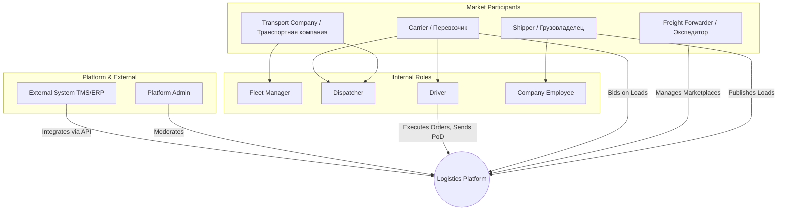
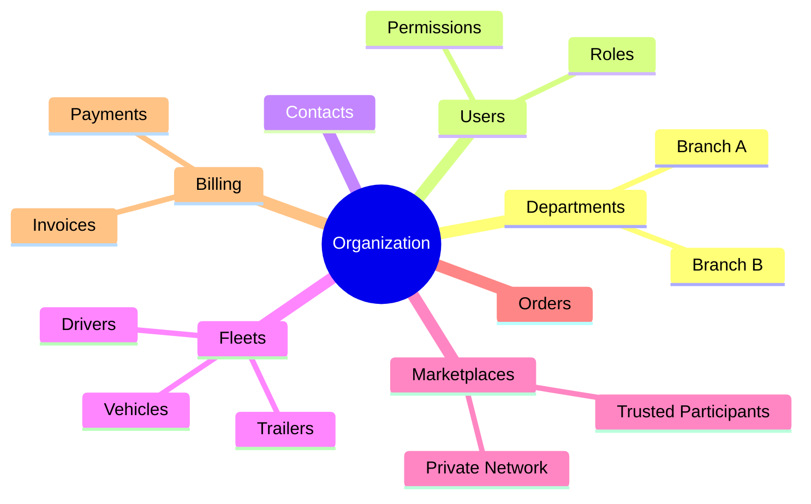

# Актёры и роли

## Связанные документы

- [Обзор продукта](file:///c:/var/cargo-docs/docs/01-product-and-domain/product-overview.md)

## 1. Обзор акторов

## 2. Детальное описание каждого актора

### Shipper / Грузовладелец

- **Роль:** Компания или подразделение (производитель, ритейлер), которое нуждается в перевозке грузов.
- **Основные сценарии:** Публикация груза, поиск перевозчика, организация тендеров, переговоры, мониторинг выполнения перевозки, подтверждение доставки, оплата услуг.
- **Ключевые потребности:** Надёжный перевозчик, прозрачная цена, видимость перевозки в реальном времени.
- **Уровень доступа:** Управление своими грузами, заказами, ограниченный просмотр профилей перевозчиков (публичные данные и рейтинг).

### Freight Forwarder / Экспедитор

- **Роль:** Посредник, организующий перевозку от имени грузовладельца.
- **Отличия от Shipper:** Работает с множеством грузовладельцев и перевозчиков одновременно, часто управляет собственными приватными биржами (private marketplace).
- **Дополнительные возможности:** Управление контрагентами, консолидация грузов, выставление сквозных счетов.

### Carrier / Перевозчик

- **Роль:** Компания или ИП, непосредственно осуществляющая грузоперевозку.
- **Основные сценарии:** Поиск грузов, публикация свободного транспорта (truck offer), подача коммерческих предложений (офферов), принятие заказа, назначение водителя и машины.
- **Дополнительно:** Управление своим автопарком (добавление ТС), управление водителями, отслеживание статуса своих перевозок.

### Transport Company / Транспортная компания

- **Отличие от Carrier:** Более крупная организация с развитой внутренней иерархией: несколько филиалов или подразделений, крупные автопарки, выделенная диспетчерская служба, менеджеры автопарка.

### Fleet Manager / Управляющий автопарком

- **Роль:** Сотрудник, ответственный за управление транспортными средствами и их доступностью.
- **Сценарии:** Добавление, редактирование, удаление ТС и прицепов, управление доступностью, прохождение верификации ТС, назначение ТС на маршруты или за водителями.

### Dispatcher / Диспетчер

- **Роль:** Сотрудник, осуществляющий оперативное управление перевозками.
- **Сценарии:** Мониторинг активных рейсов, работа с задержками и исключениями, коммуникация с водителями (мессенджер), перепланирование маршрутов.

### Driver / Водитель

- **Роль:** Непосредственный исполнитель транспортной задачи на линии.
- **Интерфейс:** Взаимодействует с платформой преимущественно через мобильное приложение.
- **Сценарии:** Получение транспортного задания, навигация, обновление статусов («на погрузке», «в пути»), фотофиксация документов (Proof of Delivery), электронная подпись.

### Company Employee / Сотрудник компании

- **Роль:** Пользователь внутри организации-участника.
- **Уровень доступа:** Определяется выданной ролью (RBAC) внутри организации (например, бухгалтер имеет доступ только к счетам и актам, менеджер по логистике — к грузам).

### Trusted Counterparty / Доверенный контрагент

- **Роль:** Перевозчик или экспедитор, с которым у Shipper установлены долгосрочные доверительные отношения.
- **Доступ:** Имеет доступ к закрытым (private) биржам грузов, получает приоритет при автоматическом matching-е.

### Platform Admin / Администратор платформы

- **Роль:** Сотрудник оператора платформы, обеспечивающий её бесперебойную работу и безопасность.
- **Сценарии:** Модерация профилей, KYC/KYB верификация компаний, разрешение споров, обработка жалоб, блокировка аккаунтов, доступ к платформенной аналитике и аудиту.

### External System / Внешняя система

- **Типы:** TMS (Transport Management System), ERP, WMS, GPS-провайдеры, платёжные шлюзы.
- **Взаимодействие:** Обмен данными через REST API, webhooks, асинхронные события (Kafka/RabbitMQ).
- **Авторизация:** OAuth2 (Client Credentials), API keys, Service Accounts.

## 3. Матрица «Актор × Операция»

| Операция                   | Shipper | Forwarder | Carrier | Dispatcher | Driver | Admin |
| :------------------------- | :------ | :-------- | :------ | :--------- | :----- | :---- |
| **Публикация груза**       | Full    | Full      | None    | None       | None   | Read  |
| **Публикация truck offer** | None    | None      | Full    | Full       | None   | Read  |
| **Поиск грузов**           | Read    | Read      | Full    | Full       | None   | Full  |
| **Создание оффера**        | None    | None      | Full    | Full       | None   | Read  |
| **Принятие оффера**        | Full    | Full      | None    | None       | None   | Read  |
| **Создание заказа**        | Full    | Full      | Own     | Own        | None   | Full  |
| **Назначение водителя**    | None    | None      | Full    | Full       | None   | Read  |
| **GPS-трекинг**            | Own     | Own       | Own     | Own        | Own    | Full  |
| **Загрузка документов**    | Own     | Own       | Own     | Own        | Full   | Read  |
| **Подтверждение доставки** | Full    | Full      | Own     | Own        | Full   | Full  |
| **Управление компанией**   | Own     | Own       | Own     | None       | None   | Full  |
| **Верификация**            | None    | None      | None    | None       | None   | Full  |
| **Аналитика платформы**    | None    | None      | None    | None       | None   | Full  |

_(Full = полный доступ к функции, Read = просмотр, Own = управление только своими/назначенными сущностями, None = нет доступа)._

## 4. Организационная иерархия

