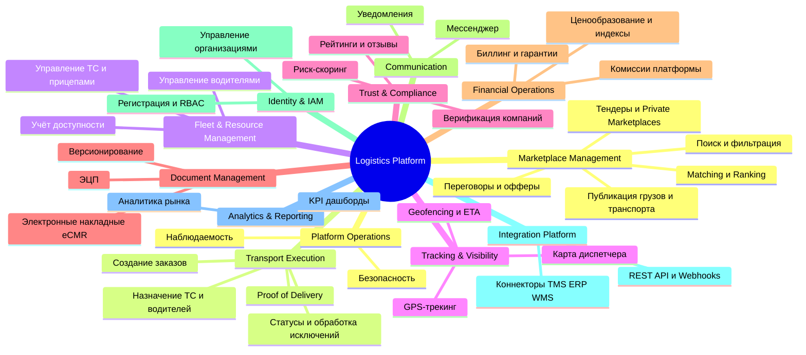

# Карта бизнес-возможностей (Business Capability Map)

## Связанные документы

- [Обзор продукта](file:///c:/var/cargo-docs/docs/01-product-and-domain/product-overview.md)

## 1. Что такое Business Capability Map

Карта бизнес-возможностей (Business Capability Map) — это высокоуровневое описание того, **что** бизнес или платформа умеет и должна делать для успешного функционирования, независимо от того, **как** (с помощью каких технологий или процессов) это реализовано. Она помогает выровнять архитектуру IT-решений с бизнес-целями.

## 2. Business Capability Map (иерархическая)

### Детализация (Level 2)

1. **Marketplace Management**
   - Публикация грузов / транспорта
   - Поиск, фильтрация, Geo-поиск
   - Matching (автоматический подбор) и Ranking
   - Рекомендации
   - Переговоры, counter-offers, тендеры
   - Private marketplaces
   - Duplicate и Fraud detection

2. **Transport Execution**
   - Создание транспортного заказа
   - Назначение транспорта и водителя
   - Управление статусами перевозки
   - Обработка исключений
   - Proof of Delivery, Multi-stop shipments

3. **Fleet & Resource Management**
   - Управление ТС, прицепами, автопарками
   - Управление водителями
   - Учёт доступности, Назначение водитель ↔ ТС

4. **Tracking & Visibility**
   - GPS-трекинг в реальном времени
   - Геозоны (geofencing), Прогресс по маршруту, ETA
   - Исторические треки, Карта диспетчера

5. **Trust & Compliance**
   - Верификация компаний
   - Рейтинги, отзывы, риск-скоринг, репутационный скоринг
   - Платёжная история, модерация

6. **Document Management**
   - Электронные документы (eCMR, накладные)
   - Загрузка, хранение, электронная подпись
   - Версионирование, пакеты документов, retention policy

7. **Financial Operations**
   - Ценообразование, индекс фрахтовых ставок
   - Комиссии платформы, выставление счетов
   - Приём платежей, гарантии (escrow), факторинг, сверка

8. **Communication**
   - Встроенный мессенджер
   - Push, Email, SMS, In-app уведомления
   - WebSocket / real-time обновления

9. **Identity & Access Management (IAM)**
   - Регистрация, аутентификация
   - Управление организациями, пользователями, ролями (RBAC)
   - API-доступ (OAuth2, API keys, Service accounts)

10. **Integration Platform**
    - REST API, Webhooks, Async events
    - Коннекторы к TMS, ERP, WMS
    - Интеграция с GPS-провайдерами, картами, платёжными шлюзами, провайдерами e-документов

11. **Analytics & Reporting**
    - Аналитика грузопотоков, рынка ставок
    - Отчёты для компаний, платформенная аналитика, KPI

12. **Platform Operations**
    - Наблюдаемость (logging, metrics, tracing)
    - Безопасность, Disaster recovery, Масштабирование, Администрирование

## 3. Маппинг Capabilities → Bounded Contexts

| Business Capability        | Предполагаемый Bounded Context | Описание                                                         |
| :------------------------- | :----------------------------- | :--------------------------------------------------------------- |
| **Marketplace Management** | `Marketplace Context`          | Ядро поиска, матчинга, торгов и офферов.                         |
| **Transport Execution**    | `Execution Context`            | Управление заказами, рейсами и статусами доставки.               |
| **Tracking & Visibility**  | `Tracking Context`             | Обработка телеметрии, GPS, геолокации.                           |
| **Fleet & Resource Mgmt**  | `Fleet Context`                | Управление транспортом, справочники машин и водителей.           |
| **Identity & IAM**         | `Identity Context`             | Авторизация, управление компаниями и ролями пользователей.       |
| **Trust & Compliance**     | `Trust Context`                | Верификация, рейтинги, отзывы и модерация.                       |
| **Document Management**    | `Document Context`             | Хранение, версионирование и ЭЦП документов.                      |
| **Financial Operations**   | `Billing Context`              | Тарификация, выставление счетов, комиссии, интеграция с банками. |
| **Communication**          | `Communication Context`        | Мессенджер, уведомления, нотификации.                            |
| **Integration Platform**   | `Integration Context`          | Webhooks, открытое API, адаптеры к внешним системам.             |
