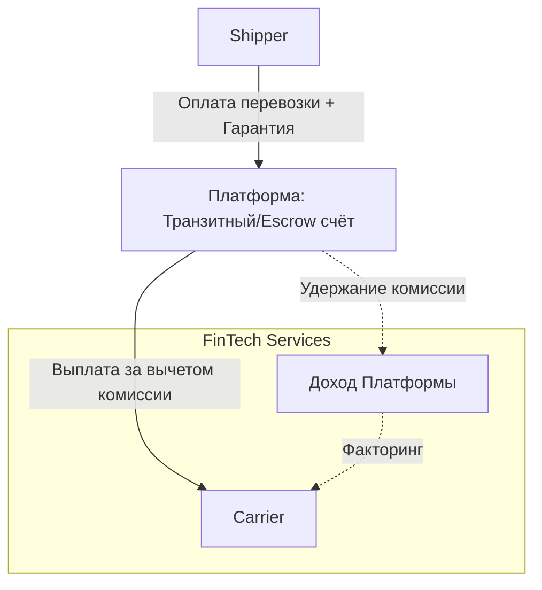

# Бизнес-модель

## Связанные документы

- [Обзор продукта](file:///c:/var/cargo-docs/docs/01-product-and-domain/product-overview.md)

## 1. Обзор бизнес-модели

Платформа является многосторонним маркетплейсом (multi-sided marketplace) и B2B SaaS-решением. Она монетизируется через несколько взаимодополняющих потоков дохода, балансируя между транзакционными сборами за успешные сделки и регулярными платежами за использование продвинутых функций (подписки).

## 2. Потоки монетизации

- **Комиссия с транзакций (Take rate):**
  - _Описание:_ Процент от стоимости перевозки при успешном закрытии транспортного заказа (или фиксированная сумма за заказ).
  - _Кто платит:_ Carrier (удерживается из оплаты) или Shipper (добавляется к ставке), в зависимости от конфигурации рынка.
  - _Когда:_ По факту завершения перевозки и подтверждения доставки.

- **Подписка (SaaS Subscription):**
  - _Описание:_ Регулярные платежи за доступ к платформе или расширенному функционалу.
  - _Кто платит:_ Организации (Shippers, Carriers, Forwarders).
  - _Когда:_ Ежемесячно или ежегодно.

- **Premium-функции (VAS - Value Added Services):**
  - _Описание:_ Платные опции внутри платформы: приоритетное размещение груза, выделение цветом, расширенная аналитика, создание Private Marketplaces и проведение закрытых тендеров.
  - _Кто платит:_ Инициатор действия (чаще Shipper или Forwarder).

- **API-доступ:**
  - _Описание:_ Тарификация доступа к платформе для внешних систем.
  - _Как рассчитывается:_ По объёму запросов (API calls / RPS) для глубоких интеграций с корпоративными TMS/ERP-системами.
  - _Кто платит:_ Крупные Shippers и Forwarders.

- **Верификация:**
  - _Описание:_ Платная услуга расширенной проверки компании (KYC/KYB), аудита безопасности. Позволяет получить бейдж «Проверенный партнёр».
  - _Кто платит:_ Carrier / Transport Company.

- **Финансовые сервисы (FinTech):**
  - _Описание:_ Комиссии за предоставление факторинга (ранняя оплата перевозчику), обеспечение платёжных гарантий (escrow), услуги по быстрому расчёту.
  - _Кто платит:_ Carrier (за факторинг), Shipper (за гарантии).

## 3. Тарифные планы

| План             | Целевая аудитория            | Включено                                                                                              | Дополнительно                         |
| :--------------- | :--------------------------- | :---------------------------------------------------------------------------------------------------- | :------------------------------------ |
| **Basic (Free)** | Мелкие Carriers, ИП          | Доступ к публичным грузам, базовый профиль, мобильное приложение водителя.                            | Транзакционная комиссия выше базовой. |
| **Pro**          | Средние Carrier / Shipper    | Безлимитный поиск, участие в тендерах, управление автопарком, расширенный профиль, базовая аналитика. | Фиксированная ежемесячная плата.      |
| **Enterprise**   | Крупные Shippers, Forwarders | Private marketplaces, API-доступ (лимитировано), RBAC, выделенный аккаунт-менеджер, интеграция с ERP. | Индивидуальный тариф + API overage.   |

## 4. Финансовый поток платформы

Движение денежных средств при сделке с использованием встроенного биллинга:

## 5. Ключевые метрики бизнес-модели

- **GMV (Gross Merchandise Value):** Общий объём денежных средств (сумма всех фрахтов), прошедших через платформу за период.
- **Take rate:** Эффективный процент комиссии, удерживаемой платформой от GMV.
- **MRR (Monthly Recurring Revenue):** Ежемесячный регулярный доход от SaaS-подписок и платных API.
- **API Revenue:** Доход, генерируемый от overage-тарификации интеграций.
- **LTV (Customer Lifetime Value) & CAC (Customer Acquisition Cost):** Пожизненная ценность клиента в соотношении со стоимостью его привлечения.
- **Churn Rate:** Процент оттока пользователей по платным подпискам.
- **Liquidity Ratio:** Метрика маркетплейса, показывающая долю успешно закрытых заявок к общему числу опубликованных грузов.
