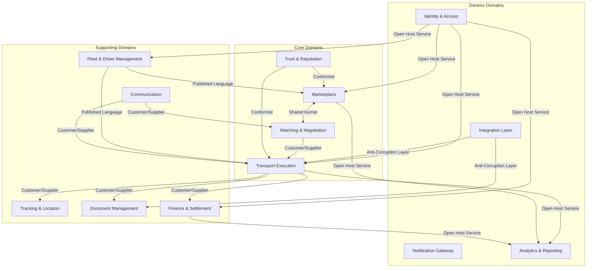

# Карта Предметной Области (Domain Map)

В данном документе представлена концептуальная карта предметной области (Domain Map) логистической платформы, категоризация ограниченных контекстов (Bounded Contexts) и таблица стратегического маппинга.

## 1. Концептуальная карта домена (Context Map)

## 2. Категоризация контекстов

В соответствии с принципами Domain-Driven Design (DDD) мы разделяем предметную область логистической платформы на три категории:

### Core Domains (Ключевые домены)

Обеспечивают основное конкурентное преимущество платформы. На них должны быть сосредоточены основные усилия по разработке и самые сильные команды.

- **Marketplace (Loads & Trucks Board)**: Доска грузов и свободного транспорта, поиск, фильтрация и формирование предложений.
- **Matching & Negotiation**: Умный подбор грузов под транспорт и транспорта под грузы, ведение торгов, согласование ставок.
- **Transport Execution (TMS)**: Управление жизненным циклом заявки (заказа) на перевозку, контроль исполнения, статусы, инциденты.
- **Trust, Verification & Reputation**: Скоринг надежности участников (перевозчиков и грузовладельцев), отзывы, история успешных/неуспешных сделок.

### Supporting Domains (Поддерживающие домены)

Необходимы для работы основного бизнеса, но сами по себе не являются уникальным конкурентным преимуществом на рынке. В идеале могут быть заменены готовыми решениями, но часто требуют кастомизации.

- **Fleet & Driver Management**: Реестр транспортных средств, профили водителей, документы на ТС и права.
- **Tracking & Location**: GPS/ГЛОНАСС мониторинг, геофенсинг, контроль местоположения груза в реальном времени.
- **Document Management & E-Signature (EDO)**: Генерация документов (заявки, договоры, ТрН), управление их жизненным циклом и подписание ЭЦП.
- **Billing, Pricing & Settlement (Finance)**: Выставление счетов, контроль оплат, биллинг подписок и дополнительных услуг платформы, клиринг.
- **Communication & Collaboration (Messenger)**: Внутренние чаты между грузовладельцем, экспедитором и перевозчиком, привязанные к конкретному заказу или торгу.

### Generic Domains (Общие домены)

Стандартные задачи, которые решаются типично в большинстве современных информационных систем. Часто реализуются путем интеграции готовых продуктов (Keycloak, Grafana, Kafka и т.д.).

- **Identity & Access Management (IAM)**: Регистрация, аутентификация, авторизация (RBAC), управление организациями (тенантность) и пользователями.
- **Notification Gateway**: Отправка Email, SMS, Push-уведомлений пользователям (роутинг и шаблонизация).
- **Analytics, Market Insights & Reporting**: Сбор аналитики, расчет индексов рынка (например, ATI Index), формирование отчетов.
- **Integration Platform (External TMS/ERP/WMS)**: Шлюз (API/EDI) для интеграции с внешними корпоративными системами клиентов.

## 3. Стратегический маппинг (Context Matrix)

Таблица описывает основные паттерны взаимодействия между выбранными ограниченными контекстами (Bounded Contexts).

| Upstream (Кто поставляет)     | Downstream (Кто потребляет) | Тип отношений               | Способ интеграции (Технология)                        | Описание                                                                                                           |
| :---------------------------- | :-------------------------- | :-------------------------- | :---------------------------------------------------- | :----------------------------------------------------------------------------------------------------------------- |
| **Identity & Access (IAM)**   | **Все остальные контексты** | Open Host Service (OHS)     | JWT Tokens (Sync), Async Events (UserCreated, etc.)   | IAM является центральным источником правды для аутентификации и профилей.                                          |
| **Marketplace**               | **Matching & Negotiation**  | Shared Kernel               | Sync REST / gRPC, In-memory (если один модуль)        | Тесная связь сущностей "Груз/Грузовик" и "Торги по Грузу". Требуется высокая консистентность.                      |
| **Matching & Negotiation**    | **Transport Execution**     | Customer/Supplier           | Async Events (DealConcluded), Sync REST               | После успешных торгов инициируется создание заявки (Заказа на перевозку).                                          |
| **Fleet & Driver Management** | **Transport Execution**     | Published Language (PL)     | Async Events (DriverUpdated), Sync gRPC               | Заказ на перевозку ссылается на конкретного водителя и ТС, используя стандартизированные DTO.                      |
| **Trust & Reputation**        | **Marketplace**             | Conformist                  | Async Events (RatingChanged), Sync REST (CheckAccess) | Маркетплейс подстраивается под модель рейтинга, чтобы фильтровать доступ к грузам.                                 |
| **Transport Execution**       | **Finance & Settlement**    | Customer/Supplier           | Async Events (OrderDelivered)                         | Завершение заказа триггерит выставление счета или изменение баланса в финансовом контуре.                          |
| **Transport Execution**       | **Document Management**     | Customer/Supplier           | Async Events, Sync REST                               | Переход статусов заказа требует генерации и подписания документов.                                                 |
| **Tracking & Location**       | **Transport Execution**     | Customer/Supplier           | Async Events (GeofenceCrossed)                        | Трекинг передает события об изменении геопозиции, что может менять статус заказа (например, "Прибыл на погрузку"). |
| **Integration Layer**         | **Transport Execution**     | Anti-Corruption Layer (ACL) | Sync API, Message Queue                               | Трансляция внешних моделей (например, из 1С ERP) в доменные модели платформы.                                      |
| **Все контексты**             | **Analytics & Reporting**   | Open Host Service (OHS)     | Async Events (ETL/CDC), Kafka                         | Контексты выгружают свои данные и события для построения глобальной аналитики и индексов.                          |
