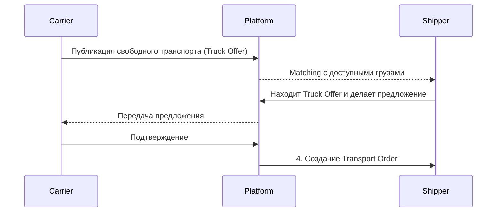

# Обзор продукта

## Связанные документы

- [Актёры и роли](file:///c:/var/cargo-docs/docs/01-product-and-domain/actors-and-roles.md)
- [Бизнес-возможности](file:///c:/var/cargo-docs/docs/01-product-and-domain/business-capabilities.md)
- [Бизнес-модель](file:///c:/var/cargo-docs/docs/01-product-and-domain/business-model.md)

## 1. Назначение платформы

Платформа представляет собой цифровую экосистему, которая:

- Объединяет всех участников рынка автомобильных грузоперевозок (грузовладельцев, экспедиторов, перевозчиков).
- Автоматизирует полный цикл грузоперевозки: от публикации груза и подбора исполнителя до финансового расчёта.
- Обеспечивает прозрачность и доверие через встроенную верификацию контрагентов, рейтинги, скоринг и историю операций.
- Предоставляет real-time visibility (видимость в реальном времени) перевозок с помощью GPS-трекинга и мобильного приложения водителя.
- Интегрируется с внешними системами: TMS (Transport Management System), ERP (Enterprise Resource Planning), WMS (Warehouse Management System) и GPS-провайдерами через открытые API.

## 2. Позиционирование

Платформа позиционируется как комплексное решение, объединяющее пять продуктов в одном:

| Компонент                 | Описание                                                                                 |
| :------------------------ | :--------------------------------------------------------------------------------------- |
| **Logistics Marketplace** | Площадка для поиска грузов и свободного транспорта (публичные и приватные биржи).        |
| **Transport Management**  | Управление заказами, перевозками, документами и автопарком.                              |
| **Real-Time Visibility**  | GPS-трекинг и мониторинг состояния перевозки в реальном времени.                         |
| **Trust Network**         | Верификация, рейтинги, репутация, история и risk scoring контрагентов.                   |
| **Integration Platform**  | API, webhooks и готовые коннекторы к TMS/ERP/WMS системам для бесшовного обмена данными. |

## 3. Основной бизнес-цикл

Типичный процесс грузоперевозки, инициированный грузовладельцем:

```mermaid
sequenceDiagram
    participant S as Shipper
    participant P as Platform
    participant C as Carrier
    participant D as Driver
    participant Ext as External (GPS/Billing)

    S->>P: 1. Публикация груза (Load)
    P-->>C: 2. Уведомление / Matching
    C->>P: 3. Предложение ставки (Offer)
    S<->C: Переговоры / Counter-offers
    S->>P: 4. Подтверждение и создание Transport Order
    P-->>C: Заказ принят
    C->>P: 5. Назначение ТС и водителя
    P->>D: Уведомление в мобильном приложении
    D->>P: 6. Подтверждение прибытия на погрузку / Выполнение (Execution)
    Ext->>P: 7. GPS-трекинг телеметрия (real-time)
    D->>P: Загрузка накладных / eCMR
    D->>P: 8. Доставка и подтверждение (Proof of Delivery)
    S->>P: Подтверждение выполнения
    P->>Ext: 9. Инициация расчёта (Settlement)
    S->>P: 10. Оценка перевозчика
    C->>P: Оценка грузовладельца
```

**Этапы:**

1. **Публикация груза:** Создание заявки на платформе.
2. **Поиск и matching:** Алгоритмы платформы подбирают перевозчиков.
3. **Переговоры:** Участники торгуются или соглашаются на фиксированную ставку.
4. **Создание заказа:** Юридически значимое оформление транспортного заказа (Transport Order).
5. **Назначение ресурсов:** Carrier назначает машину и водителя.
6. **Выполнение (Execution):** Погрузка, транспортировка.
7. **GPS-трекинг и документооборот:** Мониторинг местоположения, генерация eCMR.
8. **Доставка (Proof of Delivery):** Выгрузка и фото/сканы документов от водителя.
9. **Финансовый расчёт:** Оплата услуг, факторинг, комиссии (Settlement).
10. **Репутация:** Взаимные оценки для формирования Trust Network.

## 4. Обратный сценарий

Сценарий, когда инициатором выступает Carrier:



**Этапы:**

1. Carrier публикует свободную машину с указанием геолокации и доступности.
2. Shipper находит машину и предлагает свой груз.
3. Carrier акцептует предложение.
4. Формируется Transport Order, далее цикл аналогичен основному.

## 5. Ключевые отличия от простого «сайта с грузами»

В отличие от классических досок объявлений (load boards), платформа предлагает:

1. **Полный жизненный цикл перевозки:** Не только поиск, но и execution, документооборот и оплата.
2. **Smart Matching Engine:** Алгоритмический подбор пар груз-машина с учётом истории и рейтингов.
3. **Private Marketplaces:** Возможность создавать закрытые пулы доверенных перевозчиков и проводить тендеры.
4. **Real-time GPS-трекинг:** Интеграция с GPS-устройствами и мобильным приложением водителя.
5. **Электронный документооборот:** Поддержка eCMR, автоматическая генерация ТТН, загрузка Proof of Delivery (PoD).
6. **Система доверия (Trust Network):** KYC/KYB верификация, скоринг рисков, детальные рейтинги и отзывы.
7. **Финансовые инструменты:** Встроенный эскроу, гарантии оплаты, факторинг, биллинг комиссий.
8. **Платформа интеграции (API-First):** Возможность встроить платформу в существующие ERP/TMS решения (headless-подход).
9. **Аналитика рынка:** Доступ к агрегированным индексам фрахтовых ставок и аналитике грузопотоков.
10. **Контроль доступов (RBAC):** Поддержка сложных организационных структур, филиалов, автопарков и ролевых моделей.

## 6. Целевые масштабы

Ориентировочные фазы масштабирования платформы:

| Параметр                          | MVP   | Growth | Large Scale |
| :-------------------------------- | :---- | :----- | :---------- |
| **Организации**                   | 500   | 5,000  | 50,000+     |
| **Активные пользователи**         | 2,000 | 25,000 | 250,000+    |
| **Грузов/день**                   | 1,000 | 10,000 | 100,000+    |
| **GPS-устройств / Водителей**     | 500   | 15,000 | 150,000+    |
| **API RPS (Requests per Second)** | 50    | 500    | 5,000+      |
