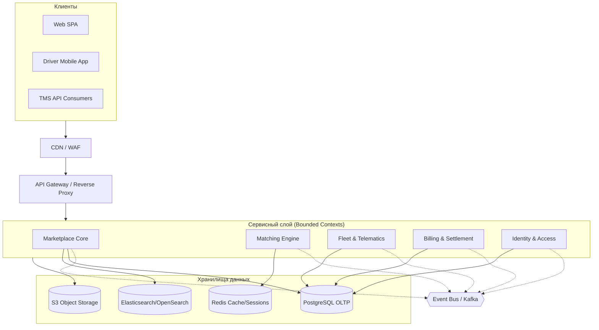

# Обзор архитектуры платформы

## Концепция трехуровневой эволюции платформы

Архитектура системы спроектирована с учетом поэтапного масштабирования (от MVP к крупномасштабной системе) без необходимости переписывания ядра. Главный принцип — строгие модульные границы (Bounded Contexts) с самого начала, что обеспечивает безболезненное разделение на микросервисы в будущем.

### Фаза 1 (MVP — Fast Time-to-Market)

- **Архитектурный стиль**: Модульный монолит (Modular Monolith) с четкими границами Bounded Contexts внутри одного репозитория/кодовой базы.
- **Инфраструктура**:
  - Managed PostgreSQL (OLTP) как основное хранилище.
  - Redis для кэширования, pub/sub и хранения сессий.
  - OpenSearch / Elasticsearch для быстрого поиска грузов и машин.
  - S3-совместимое Object Storage для хранения документов и фото (Proof of Delivery).
- **Межмодульное взаимодействие**: In-process Event Bus с обязательной поддержкой паттерна Transactional Outbox. Это гарантирует надежность доставки событий и упрощает будущий переход на распределенный брокер сообщений.

### Фаза 2 (Growth — Scaling Bottlenecks)

- **Причины перехода**: Экспоненциальный рост объема телематики (GPS-треков) и поискового трафика маркетплейса, которые начинают оказывать влияние на транзакционное ядро.
- **Выделяемые автономные сервисы**:
  - GPS Ingestion Gateway (для приема и фильтрации телеметрии).
  - Notification Service (отправка email/SMS/Push).
  - Search Indexer Pipeline (асинхронное обновление поисковых индексов).
  - Document Processing Worker (распознавание и обработка документов).
- **Внедрение Apache Kafka**: Переход от in-process шины к Kafka для асинхронного стриминга событий и надежной обработки телеметрии.

### Фаза 3 (Large Scale — High Load & Multi-region)

- **Разделение на микросервисы**: Выделение наиболее нагруженных контекстов в независимые микросервисы: Marketplace Core, Matching Engine, Fleet & Telematics, Billing & Settlement, Analytics Cluster (на базе ClickHouse).
- **Инфраструктура**: Внедрение Service Mesh для маршрутизации и безопасности, Distributed Caching, Multi-AZ / Multi-Region репликация для обеспечения отказоустойчивости.

## Архитектурный ландшафт (High-level Architecture Diagram)

## Матрица эволюции компонентов

| Компонент                 | Фаза 1 (MVP)                       | Фаза 2 (Growth)                    | Фаза 3 (Large Scale)                 | Технический триггер миграции                           |
| :------------------------ | :--------------------------------- | :--------------------------------- | :----------------------------------- | :----------------------------------------------------- |
| **API Gateway**           | Простой Nginx/Traefik              | API Gateway с Rate Limiting и Auth | Ingress/Service Mesh                 | Потребность в сложной маршрутизации и защите от DDoS.  |
| **Marketplace & Orders**  | Модуль монолита                    | Модуль монолита                    | Выделенный микросервис               | Упор в CPU/Memory на монолите из-за бизнес-логики.     |
| **GPS Telematics**        | Модуль монолита (in-process)       | Отдельный Ingestion Gateway        | Кластер микросервисов                | Деградация БД от частых UPDATE; рост объема GPS-точек. |
| **Search (Поиск)**        | Прямые SQL-запросы + Elasticsearch | Выделенный Indexer Worker          | Отдельный Search Cluster             | Медленные поисковые запросы, влияющие на OLTP.         |
| **Event Bus**             | In-process Outbox                  | Apache Kafka                       | Kafka Cluster (Multi-AZ)             | Необходимость распределенной асинхронной обработки.    |
| **Analytics & Reporting** | Реплика PostgreSQL                 | Read Replica                       | Аналитическое хранилище (ClickHouse) | Долгие аналитические запросы блокируют транзакции.     |
| **Notifications**         | Синхронно / In-process             | Выделенный Worker                  | Notification Microservice            | Очереди отправки замедляют бизнес-процессы.            |
