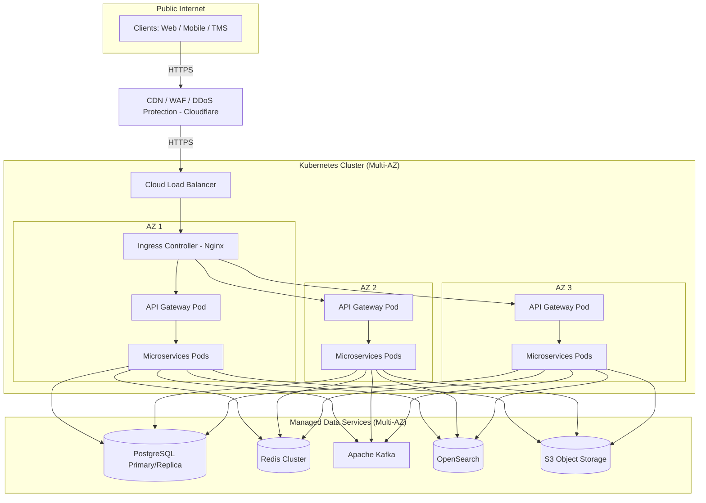

# Модель развёртывания

## 1. Топология развертывания (Kubernetes / Cloud / On-Premise)

- **Архитектура кластера Kubernetes**:
  - **Ingress Controller**: Управляет внешним доступом к сервисам в кластере, обеспечивая маршрутизацию трафика и терминацию TLS.
  - **Namespaces**: Разделение сред: `dev` (разработка), `staging` (предпродовое тестирование, зеркало продакшена), `prod` (боевая среда).
  - **Node Pools**:
    - _General purpose compute_: Для stateless микросервисов, API Gateway и бизнес-логики.
    - _Memory-optimized_: Специализированные пулы для кэширования (Redis) и поисковых индексов (OpenSearch).
    - _Storage-optimized_: Узлы с высокоскоростными SSD для баз данных (PostgreSQL) и брокеров сообщений (Kafka).
- **Multi-AZ (Availability Zones) отказоустойчивое размещение**: Распределение узлов и реплик данных по 3 независимым зонам доступности для обеспечения высокой отказоустойчивости (High Availability) и минимизации рисков при сбоях в дата-центрах.

## 2. Среды окружения (Environments)

- **Development**: Среда для активной разработки и интеграционного тестирования командами.
- **Staging**: Зеркало продакшена со срезом обезличенных данных. Используется для финального QA, нагрузочного тестирования и приемо-сдаточных испытаний (UAT) перед релизом.
- **Production**: Основная боевая среда, обслуживающая реальных пользователей платформы.

## 3. CI/CD Pipeline и стратегия релизов

- **Сборка и развертывание**:
  - Сборка Docker-образов для каждого сервиса.
  - Сканирование уязвимостей (vulnerability scanning) на этапе сборки с помощью Trivy.
  - Управление конфигурацией и деплоем через Helm-чарты и Kustomize.
- **Стратегия релизов**:
  - _Blue-Green / Rolling updates_ для stateless бэкенд-сервисов, обеспечивающие zero-downtime обновления.
  - _Canary-релизы_ для критических компонентов и высоконагруженных маршрутов (постепенный перевод части трафика на новую версию).

## 4. Диаграмма физического развертывания

