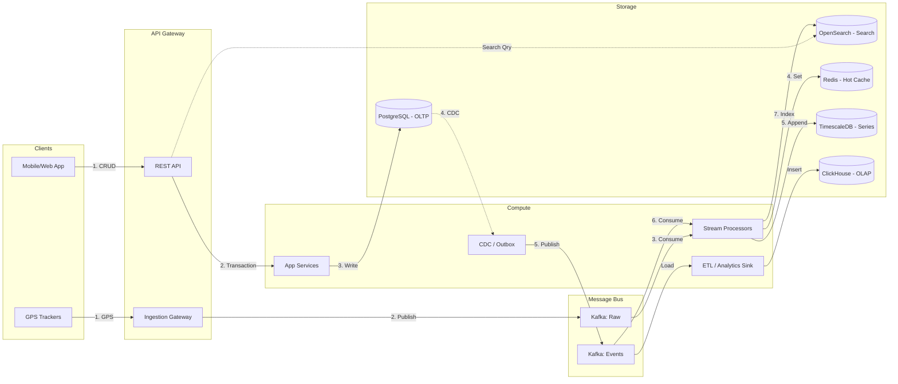

# Представление потоков данных (Data Flow View)

Раздел описывает пути движения данных в платформе, классифицированные по типу нагрузки и архитектурному паттерну.

## 1. Потоки данных платформы

### Описание потоков

1.  **Транзакционный поток (OLTP Flow)**: REST API → Application Services → PostgreSQL. Строгая консистентность (ACID), синхронные ответы пользователю.
2.  **Поисковый поток (Search/Read Model Flow)**: PostgreSQL (Outbox) → Kafka → OpenSearch → Search API Consumers. В конечном счете согласованная (Eventual Consistency) модель для быстрого полнотекстового и гео-поиска.
3.  **Телематический поток (IoT/Telematics Flow)**: GPS Trackers → Gateway → Kafka → Stream Processor → Redis (Hot, текущая позиция) + TimescaleDB (Warm, история). Оптимизировано для высокой пропускной способности на запись.
4.  **Аналитический поток (OLAP Flow)**: Kafka Events + Postgres CDC → ClickHouse → BI Dashboards / Rate Index. Подготовка данных для машинного обучения, ценообразования и отчетов.

## 2. Анализ задержек данных (Data Latency SLAs)

- **OLTP (Синхронно)**: < 200 мс. (Время ответа на HTTP-запрос создания/изменения сущности).
- **Search/Read Index (Асинхронно)**: 1 - 3 сек. (Время от сохранения в PostgreSQL до появления сущности в результатах поиска OpenSearch). Зависит от лага CDC и Kafka.
- **IoT/Telematics (Стриминг)**: < 500 мс. (Время от приема GPS пакета до появления позиции на карте диспетчера через WebSocket).
- **OLAP (Аналитика)**: 1 - 5 минут (Micro-batching) до 24 часов (Ежедневные ETL-джобы). Зависит от агрегации в Data Warehouse.
