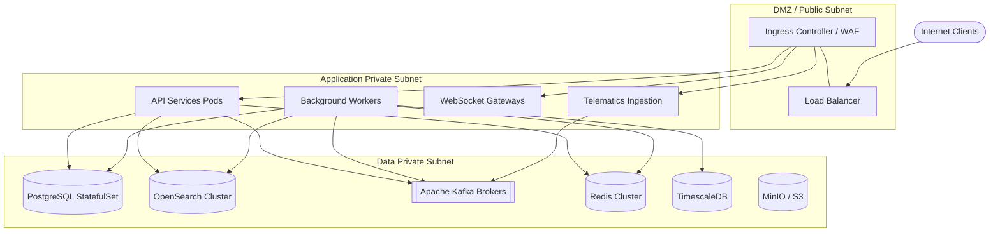

# Физическое представление развертывания (Deployment View)

В данном разделе описывается маппинг программных компонентов на физическую/виртуальную инфраструктуру, сетевая топология и требования к ресурсам.

## 1. Топология и распределение артефактов

Система развертывается в Kubernetes-кластере, разделенном на логические зоны (Subnets):

## 2. Сетевая топология

- **DMZ / Public Subnet**: Точка входа в систему. Содержит балансировщики нагрузки (L4/L7), Web Application Firewall (WAF) и Ingress Controllers. Прямой доступ извне открыт только сюда (порты 80, 443).
- **Application Private Subnet**: Содержит эфемерные (stateless) поды с бизнес-логикой: API микросервисы, воркеры обработки очередей, шлюзы. Доступны только из DMZ. Масштабируются горизонтально (HPA).
- **Data Private Subnet**: Изолированная подсеть для хранения данных. Содержит базы данных (PostgreSQL, TimescaleDB), брокер сообщений (Kafka), кэш (Redis) и поисковый движок (OpenSearch). Доступ извне закрыт, связь возможна только из Application Subnet.

## 3. Требования к ресурсам (Resource Requirements)

Примерные требования на один узел (Node) / под (Pod) для производственной среды:

| Компонент        | Тип           | CPU (Requests/Limits) | RAM (Requests/Limits) | Storage        | Network   |
| :--------------- | :------------ | :-------------------- | :-------------------- | :------------- | :-------- |
| **API Services** | Stateless Pod | 0.5 - 2 vCPU          | 512MB - 2GB           | -              | High      |
| **Workers**      | Stateless Pod | 0.5 - 2 vCPU          | 1GB - 4GB             | -              | High      |
| **PostgreSQL**   | Stateful Node | 8 - 16 vCPU           | 32GB - 64GB           | 1TB+ (NVMe)    | Moderate  |
| **OpenSearch**   | Stateful Node | 8 - 16 vCPU           | 32GB - 64GB (JVM)     | 2TB+ (SSD)     | High      |
| **Kafka Broker** | Stateful Node | 4 - 8 vCPU            | 16GB - 32GB           | 1TB+ (SSD)     | Very High |
| **Redis**        | Stateful Node | 2 - 4 vCPU            | 8GB - 32GB            | -              | Moderate  |
| **TimescaleDB**  | Stateful Node | 8 - 16 vCPU           | 32GB - 64GB           | 5TB+ (SSD/HDD) | High      |
