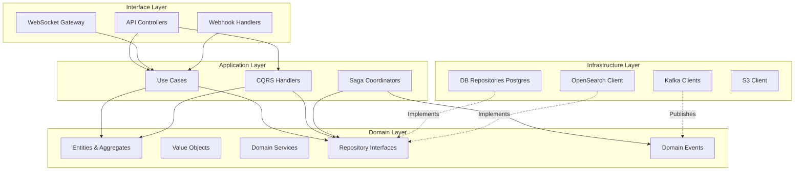

# Логическое представление (Logical View)

В данном разделе описывается логическая структура логистической платформы, её декомпозиция на пакеты, модули и уровни абстракции в соответствии с принципами чистой архитектуры (Clean Architecture).

## 1. Декомпозиция системы (Layered Architecture)

Система разделена на четыре основных уровня абстракции, каждый из которых имеет строгие зоны ответственности:

- **Interface Layer (Уровень представления / API)**:
  - API Controllers (REST API для клиентских приложений).
  - Webhook Handlers (обработка внешних событий).
  - WebSocket Gateways (real-time обновления для фронтенда).
  - CLI (инструменты администрирования).
- **Application Layer (Прикладной уровень)**:
  - Use Case Handlers (координация бизнес-сценариев).
  - Command/Query Handlers (CQRS - разделение операций чтения и записи).
  - Saga Coordinators (управление распределенными транзакциями).
- **Domain Layer (Доменный уровень)**:
  - Aggregates & Entities (основные бизнес-сущности: Груз, Заказ, Маршрут).
  - Value Objects (неизменяемые объекты: Координаты, Деньги).
  - Domain Services (бизнес-логика, не принадлежащая одной сущности).
  - Domain Events (события, происходящие в домене).
  - Repositories Interfaces (контракты для работы с хранилищами).
- **Infrastructure Layer (Инфраструктурный уровень)**:
  - DB Repositories (реализация интерфейсов репозиториев, PostgreSQL).
  - Kafka Producers/Consumers (интеграция с шиной сообщений).
  - OpenSearch Client (взаимодействие с поисковым движком).
  - S3 Client (работа с объектным хранилищем).
  - Telematics Decoders (парсинг сырых GPS-данных).

## 2. Диаграмма зависимостей модулей и подсистем

## 3. Правила соблюдения чистой архитектуры

1.  **Dependency Inversion Principle (DIP)**: Зависимости должны быть направлены только внутрь, в сторону доменного уровня. Внешние уровни (Infrastructure, Interface) зависят от внутренних (Application, Domain), но не наоборот.
2.  **Запрет циклических зависимостей**: Модули не должны ссылаться друг на друга по кругу. Используйте инверсию зависимостей (интерфейсы) или медиаторы для разрыва циклов.
3.  **Изоляция домена**: Domain Layer не должен содержать никаких ссылок на внешние библиотеки, фреймворки (кроме базовых) или инфраструктурные компоненты (SQL, HTTP).
4.  **Слабая связность (Loose Coupling)**: Взаимодействие между агрегатами должно происходить в основном через Domain Events, а не через прямые вызовы методов.
