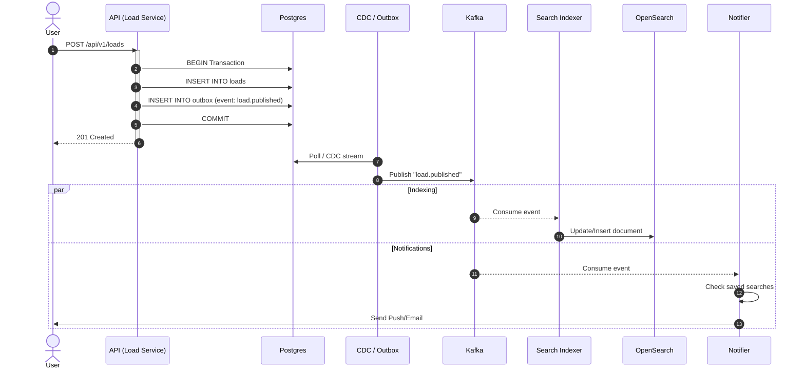
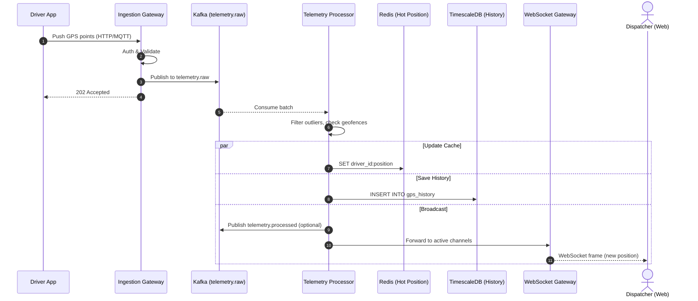
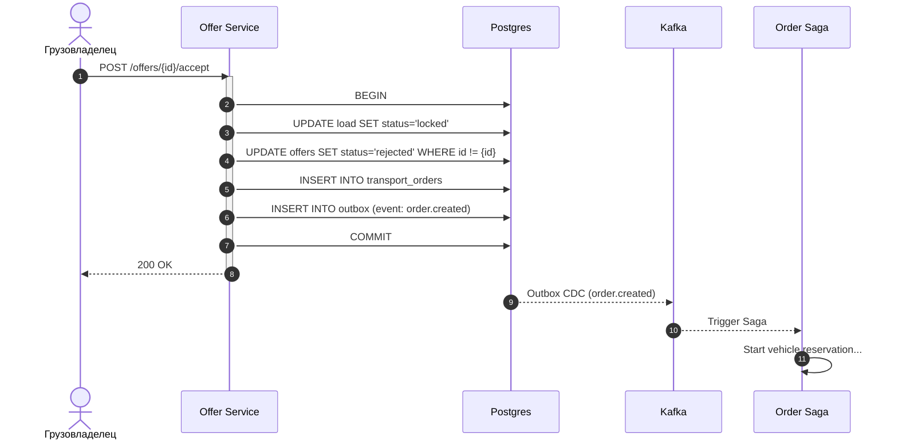

# Представление процессов и времени выполнения (Runtime View)

В данном разделе описывается динамическое поведение системы: параллелизм, потоки выполнения, очереди и межпроцессное взаимодействие, а также сценарии обработки данных в реальном времени.

## 1. Параллелизм и межпроцессное взаимодействие

Платформа спроектирована для высоких нагрузок и асинхронной обработки:

- **Синхронные потоки (REST/gRPC)**: Обработка HTTP-запросов пользователей и API-клиентов. Ограничены тайм-аутами, служат для быстрого ответа клиенту (OLTP).
- **Асинхронные потоки (Message Brokers)**: Использование Apache Kafka для передачи событий между микросервисами. Обеспечивает слабую связность и гарантированную доставку (At-Least-Once).
- **Фоновые воркеры (Workers/Cron)**: Процессы, вычитывающие данные из Kafka или выполняющие задачи по расписанию (очистка, генерация отчетов).
- **Паттерн Transactional Outbox**: Гарантирует атомарность сохранения в БД (PostgreSQL) и отправки события в Kafka через механизм CDC (Change Data Capture) или Outbox Poller.

## 2. Ключевые сценарии реального времени

### Сценарий 1: Публикация груза и индексация

### Сценарий 2: Прием и обработка GPS-координаты

### Сценарий 3: Мгновенное заключение сделки (Offer Acceptance)

