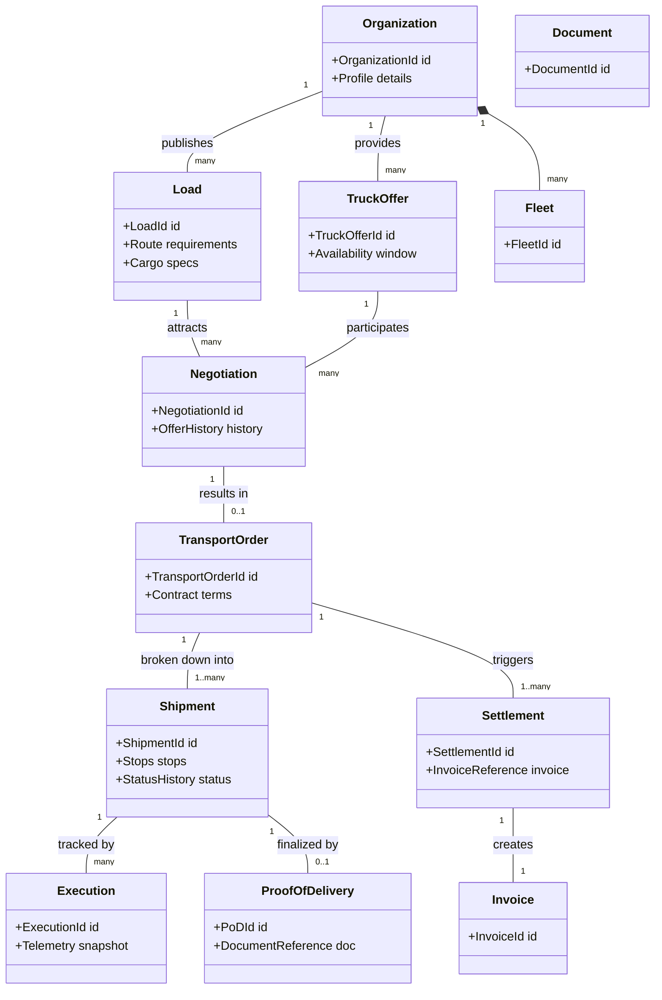
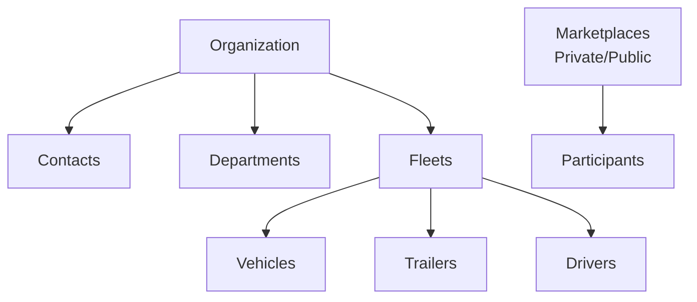

# Концептуальная модель предметной области (Domain Model)

## 1. Концептуальная модель предметной области

## 2. Разделение и обоснование жизненного цикла сущностей

В рамках логистической платформы крайне важно избегать антипаттерна «God Object Order» (единого объекта "Заказ", который обрастает сотнями полей и статусов на каждом этапе). Жизненный цикл перевозки разбит на отдельные сущности, каждая из которых имеет свои инварианты, правила изменения и зону ответственности:

- **`Load` (Груз/Потребность)**: Это маркетинговое объявление или выражение спроса на перевозку. Груз может быть отменен, устареть или собрать множество откликов (офферов). Его жизненный цикл заканчивается, когда потребность закрыта.
- **`Offer` / `CounterOffer` (Предложение)**: Коммерческое предложение от конкретного перевозчика по конкретному грузу или от грузовладельца по транспорту. Содержит цену и условия готовности.
- **`Negotiation` (Торги)**: Сессия торга между двумя конкретными сторонами. Инкапсулирует историю встречных предложений и процесс достижения консенсуса.
- **`TransportOrder` (Коммерческий заказ)**: Юридический контракт (договор-заявка) между сторонами с зафиксированной стоимостью, условиями оплаты и обязательствами. Возникает только после успешного завершения торгов (или прямого акцепта).
- **`Shipment` (Физическая перевозка)**: Описывает физический процесс перемещения груза. Один `TransportOrder` может порождать несколько `Shipment` (например, при мультимодальной доставке или если груз не помещается в одну машину и требуется несколько рейсов).
- **`Execution` (Исполнение)**: Операционный статус исполнения в реальном времени. Отслеживает телеметрию, прохождение точек маршрута (в пути, на погрузке, поломка).
- **`ProofOfDelivery (PoD)` (Подтверждение доставки)**: Документальное и фото-подтверждение факта передачи груза получателю. Служит триггером для перехода к финансовым расчетам.
- **`Settlement` (Расчеты)**: Бухгалтерский и финансовый процесс. Включает формирование счетов, расчет комиссий платформы, учет возможных штрафов или претензий и контроль оплаты.

## 3. Организационная структура в домене

Структура взаимосвязей внутри субъектов платформы (Организаций) и Маркетплейсов.

## 4. Классификация сущностей платформы

| Имя сущности         | Bounded Context            | Роль в DDD              |
| -------------------- | -------------------------- | ----------------------- |
| `Load`               | Marketplace (Demand)       | Aggregate Root          |
| `TruckOffer`         | Marketplace (Supply)       | Aggregate Root          |
| `Negotiation`        | Negotiation / Bidding      | Aggregate Root          |
| `TransportOrder`     | Order Management           | Aggregate Root          |
| `Shipment`           | Transportation / Execution | Aggregate Root          |
| `Execution`          | Transportation / Execution | Entity                  |
| `ProofOfDelivery`    | Document Management        | Entity / Aggregate Root |
| `Settlement`         | Billing & Finance          | Aggregate Root          |
| `Organization`       | Identity & Access / Core   | Aggregate Root          |
| `Fleet`              | Resource Management        | Aggregate Root / Entity |
| `Vehicle`            | Resource Management        | Aggregate Root          |
| `Document`           | Document Management        | Aggregate Root          |
| `Invoice`            | Billing & Finance          | Aggregate Root          |
| `CargoSpecification` | Marketplace / Order        | Value Object            |
| `PriceExpectation`   | Marketplace / Negotiation  | Value Object            |
| `LoadPublished`      | Marketplace (Demand)       | Domain Event            |
