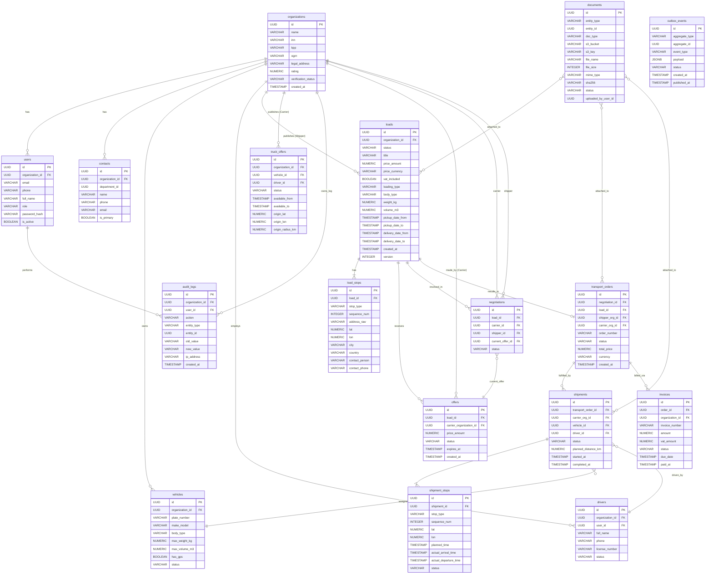

# Core Entity-Relationship Diagram (ERD)

Реляционная модель ядра логистической платформы.

```mermaid
erDiagram
    organizations ||--o{ users : "has"
    organizations ||--o{ contacts : "has"
    organizations ||--o{ vehicles : "owns"
    organizations ||--o{ drivers : "employs"
    organizations ||--o{ loads : "publishes (Shipper)"
    organizations ||--o{ truck_offers : "publishes (Carrier)"

    loads ||--|{ load_stops : "has"
    loads ||--o{ offers : "receives"
    loads ||--o{ negotiations : "involved_in"
    loads ||--o| transport_orders : "results_in"

    offers }o--|| organizations : "made_by (Carrier)"
    negotiations }o--|| organizations : "carrier"
    negotiations }o--|| organizations : "shipper"
    negotiations }o--|| offers : "current_offer"

    transport_orders ||--o{ shipments : "fulfilled_by"
    transport_orders ||--o{ invoices : "billed_via"

    shipments ||--|{ shipment_stops : "has"
    shipments }o--|| vehicles : "assigned_to"
    shipments }o--|| drivers : "driven_by"

    users ||--o{ audit_logs : "performs"
    organizations ||--o{ audit_logs : "owns_log"

    %% Documents polymorphic relation (simplified)
    documents }o--o{ loads : "attached_to"
    documents }o--o{ transport_orders : "attached_to"
    documents }o--o{ shipments : "attached_to"

    organizations {
        UUID id PK
        VARCHAR name
        VARCHAR inn
        VARCHAR kpp
        VARCHAR ogrn
        VARCHAR legal_address
        NUMERIC rating
        VARCHAR verification_status
        TIMESTAMP created_at
    }

    users {
        UUID id PK
        UUID organization_id FK
        VARCHAR email
        VARCHAR phone
        VARCHAR full_name
        VARCHAR role
        VARCHAR password_hash
        BOOLEAN is_active
    }

    contacts {
        UUID id PK
        UUID organization_id FK
        UUID department_id
        VARCHAR name
        VARCHAR phone
        VARCHAR email
        BOOLEAN is_primary
    }

    loads {
        UUID id PK
        UUID organization_id FK
        VARCHAR status
        VARCHAR title
        NUMERIC price_amount
        VARCHAR price_currency
        BOOLEAN vat_included
        VARCHAR loading_type
        VARCHAR body_type
        NUMERIC weight_kg
        NUMERIC volume_m3
        TIMESTAMP pickup_date_from
        TIMESTAMP pickup_date_to
        TIMESTAMP delivery_date_from
        TIMESTAMP delivery_date_to
        TIMESTAMP created_at
        INTEGER version
    }

    load_stops {
        UUID id PK
        UUID load_id FK
        VARCHAR stop_type
        INTEGER sequence_num
        VARCHAR address_raw
        NUMERIC lat
        NUMERIC lon
        VARCHAR city
        VARCHAR country
        VARCHAR contact_person
        VARCHAR contact_phone
    }

    truck_offers {
        UUID id PK
        UUID organization_id FK
        UUID vehicle_id FK
        UUID driver_id FK
        VARCHAR status
        TIMESTAMP available_from
        TIMESTAMP available_to
        NUMERIC origin_lat
        NUMERIC origin_lon
        NUMERIC origin_radius_km
    }

    offers {
        UUID id PK
        UUID load_id FK
        UUID carrier_organization_id FK
        NUMERIC price_amount
        VARCHAR status
        TIMESTAMP expires_at
        TIMESTAMP created_at
    }

    negotiations {
        UUID id PK
        UUID load_id FK
        UUID carrier_id FK
        UUID shipper_id FK
        UUID current_offer_id FK
        VARCHAR status
    }

    transport_orders {
        UUID id PK
        UUID negotiation_id FK
        UUID load_id FK
        UUID shipper_org_id FK
        UUID carrier_org_id FK
        VARCHAR order_number
        VARCHAR status
        NUMERIC total_price
        VARCHAR currency
        TIMESTAMP created_at
    }

    shipments {
        UUID id PK
        UUID transport_order_id FK
        UUID carrier_org_id FK
        UUID vehicle_id FK
        UUID driver_id FK
        VARCHAR status
        NUMERIC planned_distance_km
        TIMESTAMP started_at
        TIMESTAMP completed_at
    }

    shipment_stops {
        UUID id PK
        UUID shipment_id FK
        VARCHAR stop_type
        INTEGER sequence_num
        NUMERIC lat
        NUMERIC lon
        TIMESTAMP planned_time
        TIMESTAMP actual_arrival_time
        TIMESTAMP actual_departure_time
        VARCHAR status
    }

    vehicles {
        UUID id PK
        UUID organization_id FK
        VARCHAR plate_number
        VARCHAR make_model
        VARCHAR body_type
        NUMERIC max_weight_kg
        NUMERIC max_volume_m3
        BOOLEAN has_gps
        VARCHAR status
    }

    drivers {
        UUID id PK
        UUID organization_id FK
        UUID user_id FK
        VARCHAR full_name
        VARCHAR phone
        VARCHAR license_number
        VARCHAR status
    }

    documents {
        UUID id PK
        VARCHAR entity_type
        UUID entity_id
        VARCHAR doc_type
        VARCHAR s3_bucket
        VARCHAR s3_key
        VARCHAR file_name
        INTEGER file_size
        VARCHAR mime_type
        VARCHAR sha256
        VARCHAR status
        UUID uploaded_by_user_id
    }

    invoices {
        UUID id PK
        UUID order_id FK
        UUID organization_id FK
        VARCHAR invoice_number
        NUMERIC amount
        NUMERIC vat_amount
        VARCHAR status
        TIMESTAMP due_date
        TIMESTAMP paid_at
    }

    audit_logs {
        UUID id PK
        UUID organization_id FK
        UUID user_id FK
        VARCHAR action
        VARCHAR entity_type
        UUID entity_id
        VARCHAR old_value
        VARCHAR new_value
        VARCHAR ip_address
        TIMESTAMP created_at
    }

    outbox_events {
        UUID id PK
        VARCHAR aggregate_type
        UUID aggregate_id
        VARCHAR event_type
        JSONB payload
        VARCHAR status
        TIMESTAMP created_at
        TIMESTAMP published_at
    }
```
