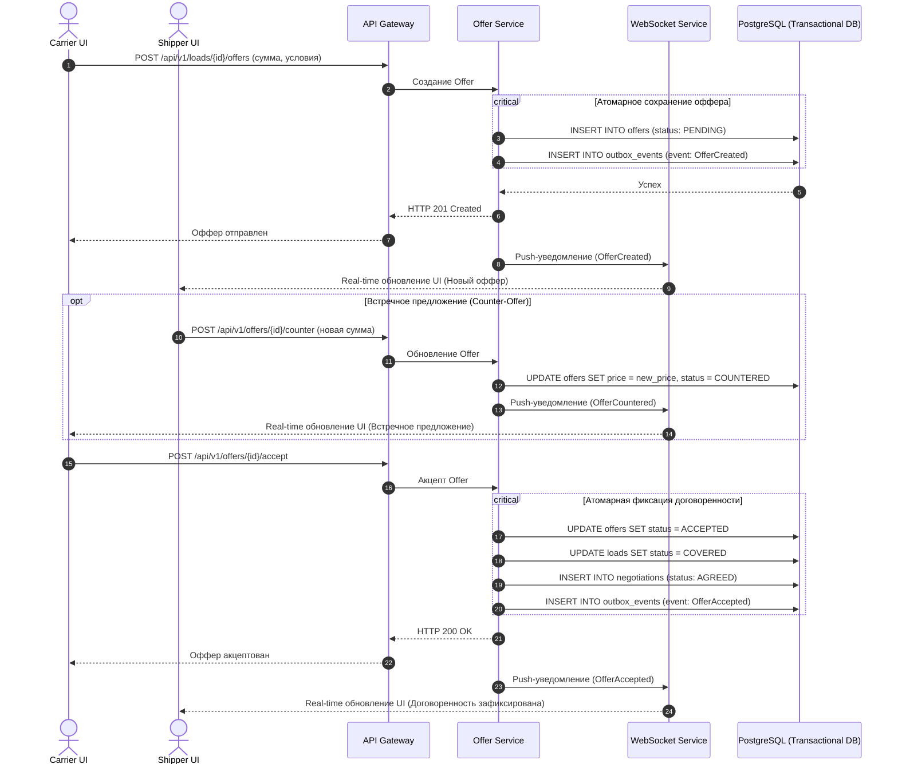

# Торги и акцепт предложения (Accept Offer)

Диаграмма последовательности процесса торгов между перевозчиком и грузоотправителем в реальном времени.

```mermaid
sequenceDiagram
    autonumber
    actor Carrier as Carrier UI
    actor Shipper as Shipper UI
    participant Gateway as API Gateway
    participant OfferService as Offer Service
    participant WS as WebSocket Service
    participant DB as PostgreSQL (Transactional DB)

    Carrier->>Gateway: POST /api/v1/loads/{id}/offers (сумма, условия)
    Gateway->>OfferService: Создание Offer

    critical Атомарное сохранение оффера
        OfferService->>DB: INSERT INTO offers (status: PENDING)
        OfferService->>DB: INSERT INTO outbox_events (event: OfferCreated)
    end
    DB-->>OfferService: Успех

    OfferService-->>Gateway: HTTP 201 Created
    Gateway-->>Carrier: Оффер отправлен

    OfferService->>WS: Push-уведомление (OfferCreated)
    WS-->>Shipper: Real-time обновление UI (Новый оффер)

    opt Встречное предложение (Counter-Offer)
        Shipper->>Gateway: POST /api/v1/offers/{id}/counter (новая сумма)
        Gateway->>OfferService: Обновление Offer
        OfferService->>DB: UPDATE offers SET price = new_price, status = COUNTERED
        OfferService->>WS: Push-уведомление (OfferCountered)
        WS-->>Carrier: Real-time обновление UI (Встречное предложение)
    end

    Carrier->>Gateway: POST /api/v1/offers/{id}/accept
    Gateway->>OfferService: Акцепт Offer

    critical Атомарная фиксация договоренности
        OfferService->>DB: UPDATE offers SET status = ACCEPTED
        OfferService->>DB: UPDATE loads SET status = COVERED
        OfferService->>DB: INSERT INTO negotiations (status: AGREED)
        OfferService->>DB: INSERT INTO outbox_events (event: OfferAccepted)
    end

    OfferService-->>Gateway: HTTP 200 OK
    Gateway-->>Carrier: Оффер акцептован
    OfferService->>WS: Push-уведомление (OfferAccepted)
    WS-->>Shipper: Real-time обновление UI (Договоренность зафиксирована)
```
