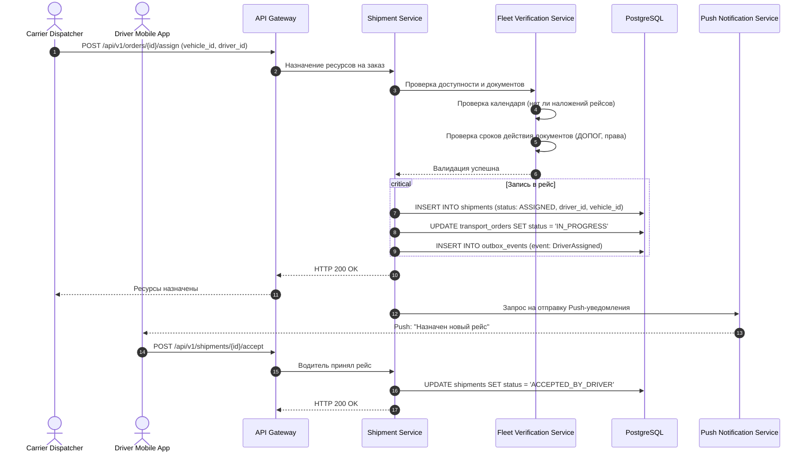

# Назначение машины и водителя (Assign Driver)

Диаграмма последовательности процесса распределения ресурса (водителя и ТС) на рейс.

```mermaid
sequenceDiagram
    autonumber
    actor Dispatcher as Carrier Dispatcher
    actor Driver as Driver Mobile App
    participant Gateway as API Gateway
    participant ShipmentService as Shipment Service
    participant FleetService as Fleet Verification Service
    participant DB as PostgreSQL
    participant Notification as Push Notification Service

    Dispatcher->>Gateway: POST /api/v1/orders/{id}/assign (vehicle_id, driver_id)
    Gateway->>ShipmentService: Назначение ресурсов на заказ

    ShipmentService->>FleetService: Проверка доступности и документов
    FleetService->>FleetService: Проверка календаря (нет ли наложений рейсов)
    FleetService->>FleetService: Проверка сроков действия документов (ДОПОГ, права)
    FleetService-->>ShipmentService: Валидация успешна

    critical Запись в рейс
        ShipmentService->>DB: INSERT INTO shipments (status: ASSIGNED, driver_id, vehicle_id)
        ShipmentService->>DB: UPDATE transport_orders SET status = 'IN_PROGRESS'
        ShipmentService->>DB: INSERT INTO outbox_events (event: DriverAssigned)
    end

    ShipmentService-->>Gateway: HTTP 200 OK
    Gateway-->>Dispatcher: Ресурсы назначены

    ShipmentService->>Notification: Запрос на отправку Push-уведомления
    Notification-->>Driver: Push: "Назначен новый рейс"

    Driver->>Gateway: POST /api/v1/shipments/{id}/accept
    Gateway->>ShipmentService: Водитель принял рейс
    ShipmentService->>DB: UPDATE shipments SET status = 'ACCEPTED_BY_DRIVER'
    ShipmentService-->>Gateway: HTTP 200 OK
```
