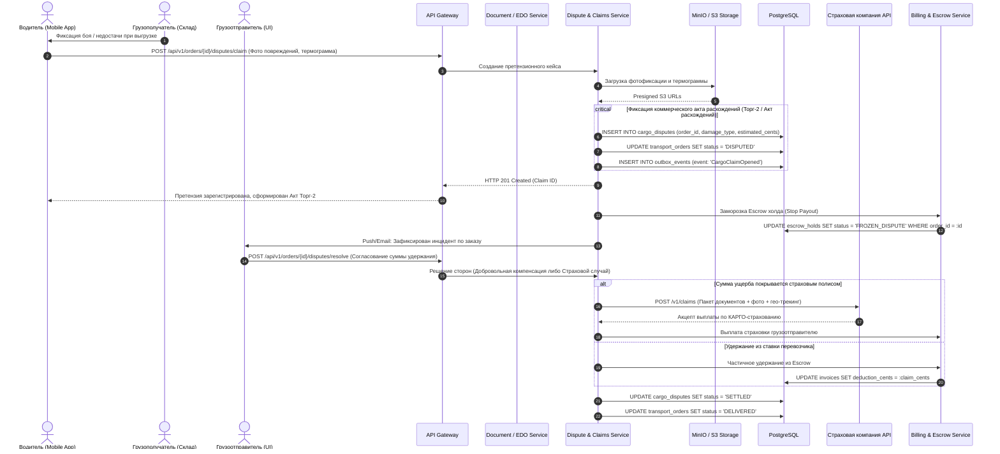

# Рекламация и фиксация повреждения груза (Cargo Damage Claim Flow)

Диаграмма последовательности действий при выявлении боя, порчи, недостачи или нарушения температурного режима при выгрузке.

```mermaid
sequenceDiagram
    autonumber
    actor Driver as Водитель (Mobile App)
    actor Recipient as Грузополучатель (Склад)
    actor Shipper as Грузоотправитель (UI)
    participant Gateway as API Gateway
    participant DocService as Document / EDO Service
    participant DisputeService as Dispute & Claims Service
    participant S3 as MinIO / S3 Storage
    participant DB as PostgreSQL
    participant Insurance as Страховая компания API
    participant Billing as Billing & Escrow Service

    Recipient->>Driver: Фиксация боя / недостачи при выгрузке
    Driver->>Gateway: POST /api/v1/orders/{id}/disputes/claim (Фото повреждений, термограмма)
    Gateway->>DisputeService: Создание претензионного кейса
    
    DisputeService->>S3: Загрузка фотофиксации и термограммы
    S3-->>DisputeService: Presigned S3 URLs
    
    critical Фиксация коммерческого акта расхождений (Торг-2 / Акт расхождений)
        DisputeService->>DB: INSERT INTO cargo_disputes (order_id, damage_type, estimated_cents)
        DisputeService->>DB: UPDATE transport_orders SET status = 'DISPUTED'
        DisputeService->>DB: INSERT INTO outbox_events (event: 'CargoClaimOpened')
    end
    
    DisputeService-->>Gateway: HTTP 201 Created (Claim ID)
    Gateway-->>Driver: Претензия зарегистрирована, сформирован Акт Торг-2

    DisputeService->>Billing: Заморозка Escrow холда (Stop Payout)
    Billing->>DB: UPDATE escrow_holds SET status = 'FROZEN_DISPUTE' WHERE order_id = :id

    DisputeService->>Shipper: Push/Email: Зафиксирован инцидент по заказу
    Shipper->>Gateway: POST /api/v1/orders/{id}/disputes/resolve (Согласование суммы удержания)
    Gateway->>DisputeService: Решение сторон (Добровольная компенсация либо Страховой случай)

    alt Сумма ущерба покрывается страховым полисом
        DisputeService->>Insurance: POST /v1/claims (Пакет документов + фото + гео-трекинг)
        Insurance-->>DisputeService: Акцепт выплаты по КАРГО-страхованию
        DisputeService->>Billing: Выплата страховки грузоотправителю
    else Удержание из ставки перевозчика
        DisputeService->>Billing: Частичное удержание из Escrow
        Billing->>DB: UPDATE invoices SET deduction_cents = :claim_cents
    end

    DisputeService->>DB: UPDATE cargo_disputes SET status = 'SETTLED'
    DisputeService->>DB: UPDATE transport_orders SET status = 'DELIVERED'
```
