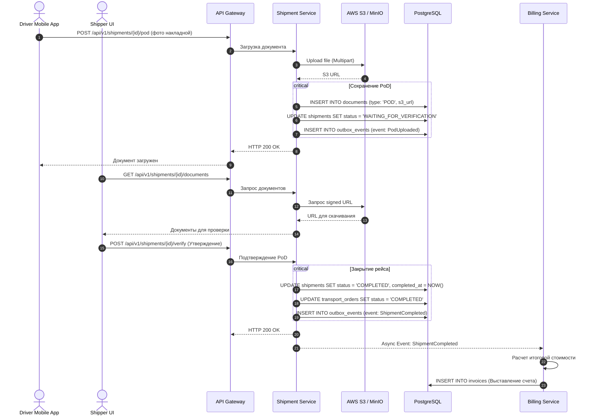

# Сдача груза и закрытие рейса (Complete Delivery)

Диаграмма последовательности процесса сдачи груза, загрузки PoD (Proof of Delivery) и биллинга.

```mermaid
sequenceDiagram
    autonumber
    actor Driver as Driver Mobile App
    actor Shipper as Shipper UI
    participant Gateway as API Gateway
    participant ShipmentService as Shipment Service
    participant S3 as AWS S3 / MinIO
    participant DB as PostgreSQL
    participant Billing as Billing Service

    Driver->>Gateway: POST /api/v1/shipments/{id}/pod (фото накладной)
    Gateway->>ShipmentService: Загрузка документа

    ShipmentService->>S3: Upload file (Multipart)
    S3-->>ShipmentService: S3 URL

    critical Сохранение PoD
        ShipmentService->>DB: INSERT INTO documents (type: 'POD', s3_url)
        ShipmentService->>DB: UPDATE shipments SET status = 'WAITING_FOR_VERIFICATION'
        ShipmentService->>DB: INSERT INTO outbox_events (event: PodUploaded)
    end
    ShipmentService-->>Gateway: HTTP 200 OK
    Gateway-->>Driver: Документ загружен

    Shipper->>Gateway: GET /api/v1/shipments/{id}/documents
    Gateway->>ShipmentService: Запрос документов
    ShipmentService->>S3: Запрос signed URL
    S3-->>ShipmentService: URL для скачивания
    ShipmentService-->>Shipper: Документы для проверки

    Shipper->>Gateway: POST /api/v1/shipments/{id}/verify (Утверждение)
    Gateway->>ShipmentService: Подтверждение PoD

    critical Закрытие рейса
        ShipmentService->>DB: UPDATE shipments SET status = 'COMPLETED', completed_at = NOW()
        ShipmentService->>DB: UPDATE transport_orders SET status = 'COMPLETED'
        ShipmentService->>DB: INSERT INTO outbox_events (event: ShipmentCompleted)
    end
    ShipmentService-->>Gateway: HTTP 200 OK

    ShipmentService-->>Billing: Async Event: ShipmentCompleted
    Billing->>Billing: Расчет итоговой стоимости
    Billing->>DB: INSERT INTO invoices (Выставление счета)
```
