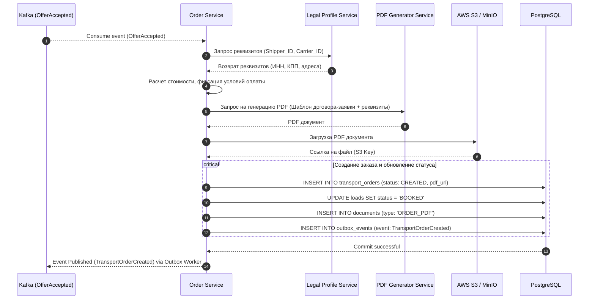

# Формирование транспортного заказа (Create Order)

Диаграмма последовательности автоматического формирования заказа после акцепта предложения.

```mermaid
sequenceDiagram
    autonumber
    participant Kafka as Kafka (OfferAccepted)
    participant OrderService as Order Service
    participant LegalService as Legal Profile Service
    participant PDFGenerator as PDF Generator Service
    participant S3 as AWS S3 / MinIO
    participant DB as PostgreSQL

    Kafka-->>OrderService: Consume event (OfferAccepted)

    OrderService->>LegalService: Запрос реквизитов (Shipper_ID, Carrier_ID)
    LegalService-->>OrderService: Возврат реквизитов (ИНН, КПП, адреса)

    OrderService->>OrderService: Расчет стоимости, фиксация условий оплаты

    OrderService->>PDFGenerator: Запрос на генерацию PDF (Шаблон договора-заявки + реквизиты)
    PDFGenerator-->>OrderService: PDF документ

    OrderService->>S3: Загрузка PDF документа
    S3-->>OrderService: Ссылка на файл (S3 Key)

    critical Создание заказа и обновление статуса
        OrderService->>DB: INSERT INTO transport_orders (status: CREATED, pdf_url)
        OrderService->>DB: UPDATE loads SET status = 'BOOKED'
        OrderService->>DB: INSERT INTO documents (type: 'ORDER_PDF')
        OrderService->>DB: INSERT INTO outbox_events (event: TransportOrderCreated)
    end
    DB-->>OrderService: Commit successful

    OrderService-->>Kafka: Event Published (TransportOrderCreated) via Outbox Worker
```
