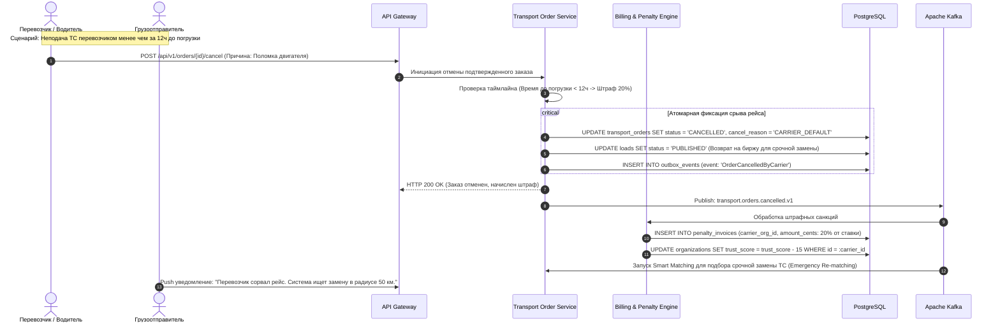

# Срыв погрузки и штрафные санкции (Order Cancellation & Penalty Flow)

Диаграмма процесса одностороннего срыва рейса (неподача ТС перевозчиком либо отказ от погрузки грузоотправителем).

```mermaid
sequenceDiagram
    autonumber
    actor Carrier as Перевозчик / Водитель
    actor Shipper as Грузоотправитель
    participant Gateway as API Gateway
    participant OrderService as Transport Order Service
    participant Billing as Billing & Penalty Engine
    participant DB as PostgreSQL
    participant Kafka as Apache Kafka

    Note over Carrier, Shipper: Сценарий: Неподача ТС перевозчиком менее чем за 12ч до погрузки

    Carrier->>Gateway: POST /api/v1/orders/{id}/cancel (Причина: Поломка двигателя)
    Gateway->>OrderService: Инициация отмены подтвержденного заказа

    OrderService->>OrderService: Проверка таймлайна (Время до погрузки < 12ч -> Штраф 20%)

    critical Атомарная фиксация срыва рейса
        OrderService->>DB: UPDATE transport_orders SET status = 'CANCELLED', cancel_reason = 'CARRIER_DEFAULT'
        OrderService->>DB: UPDATE loads SET status = 'PUBLISHED' (Возврат на биржу для срочной замены)
        OrderService->>DB: INSERT INTO outbox_events (event: 'OrderCancelledByCarrier')
    end

    OrderService-->>Gateway: HTTP 200 OK (Заказ отменен, начислен штраф)
    OrderService->>Kafka: Publish: transport.orders.cancelled.v1

    Kafka->>Billing: Обработка штрафных санкций
    Billing->>DB: INSERT INTO penalty_invoices (carrier_org_id, amount_cents: 20% от ставки)
    Billing->>DB: UPDATE organizations SET trust_score = trust_score - 15 WHERE id = :carrier_id

    Kafka->>OrderService: Запуск Smart Matching для подбора срочной замены ТС (Emergency Re-matching)
    Shipper->>Gateway: Push уведомление: "Перевозчик сорвал рейс. Система ищет замену в радиусе 50 км."
```
