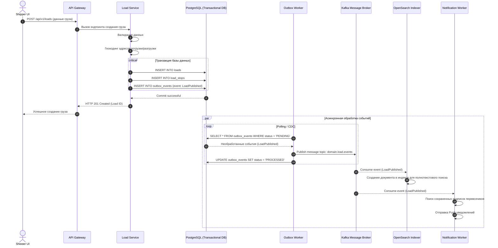

# Публикация груза (Publish Load)

Диаграмма последовательности для процесса публикации груза с использованием паттерна Transactional Outbox.

```mermaid
sequenceDiagram
    autonumber
    actor Shipper as Shipper UI
    participant Gateway as API Gateway
    participant LoadService as Load Service
    participant DB as PostgreSQL (Transactional DB)
    participant OutboxWorker as Outbox Worker
    participant Kafka as Kafka Message Broker
    participant OpenSearch as OpenSearch Indexer
    participant NotificationWorker as Notification Worker

    Shipper->>Gateway: POST /api/v1/loads (данные груза)
    Gateway->>LoadService: Вызов эндпоинта создания груза

    LoadService->>LoadService: Валидация данных
    LoadService->>LoadService: Геокодинг адресов погрузки/разгрузки

    critical Транзакция базы данных
        LoadService->>DB: INSERT INTO loads
        LoadService->>DB: INSERT INTO load_stops
        LoadService->>DB: INSERT INTO outbox_events (event: LoadPublished)
    end
    DB-->>LoadService: Commit successful

    LoadService-->>Gateway: HTTP 201 Created (Load ID)
    Gateway-->>Shipper: Успешное создание груза

    par Асинхронная обработка событий
        loop Polling / CDC
            OutboxWorker->>DB: SELECT * FROM outbox_events WHERE status = 'PENDING'
            DB-->>OutboxWorker: Необработанные события (LoadPublished)
            OutboxWorker->>Kafka: Publish message topic: domain.load.events
            OutboxWorker->>DB: UPDATE outbox_events SET status = 'PROCESSED'
        end

        Kafka-->>OpenSearch: Consume event (LoadPublished)
        OpenSearch->>OpenSearch: Создание документа в индексе для полнотекстового поиска

        Kafka-->>NotificationWorker: Consume event (LoadPublished)
        NotificationWorker->>NotificationWorker: Поиск сохраненных подписок перевозчиков
        NotificationWorker->>NotificationWorker: Отправка Push-уведомлений
    end
```
