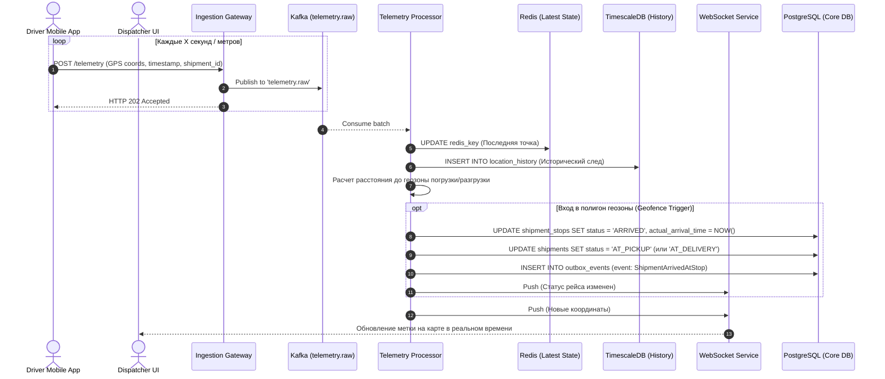

# Сквозной трекинг и обработка геозон (Track Shipment)

Диаграмма последовательности процесса трекинга GPS в реальном времени и автоматического определения прибытия.

```mermaid
sequenceDiagram
    autonumber
    actor Driver as Driver Mobile App
    actor Dispatcher as Dispatcher UI
    participant Ingestion as Ingestion Gateway
    participant Kafka as Kafka (telemetry.raw)
    participant Processor as Telemetry Processor
    participant Cache as Redis (Latest State)
    participant TSDB as TimescaleDB (History)
    participant WS as WebSocket Service
    participant DB as PostgreSQL (Core DB)

    loop Каждые X секунд / метров
        Driver->>Ingestion: POST /telemetry (GPS coords, timestamp, shipment_id)
        Ingestion->>Kafka: Publish to 'telemetry.raw'
        Ingestion-->>Driver: HTTP 202 Accepted
    end

    Kafka-->>Processor: Consume batch

    Processor->>Cache: UPDATE redis_key (Последняя точка)
    Processor->>TSDB: INSERT INTO location_history (Исторический след)

    Processor->>Processor: Расчет расстояния до геозоны погрузки/разгрузки

    opt Вход в полигон геозоны (Geofence Trigger)
        Processor->>DB: UPDATE shipment_stops SET status = 'ARRIVED', actual_arrival_time = NOW()
        Processor->>DB: UPDATE shipments SET status = 'AT_PICKUP' (или 'AT_DELIVERY')
        Processor->>DB: INSERT INTO outbox_events (event: ShipmentArrivedAtStop)
        Processor->>WS: Push (Статус рейса изменен)
    end

    Processor->>WS: Push (Новые координаты)
    WS-->>Dispatcher: Обновление метки на карте в реальном времени
```
