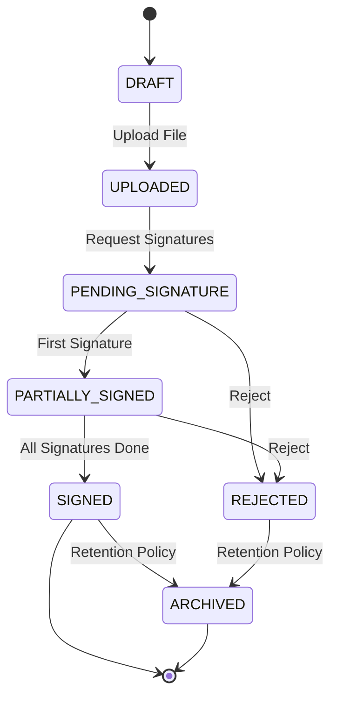

# Конечный автомат: Электронный документ (Document)

## 1. Диаграмма состояний

## 2. Таблица состояний (States Definition)

| Код состояния       | Бизнес-смысл                                   | Тип           |
| ------------------- | ---------------------------------------------- | ------------- |
| `DRAFT`             | Документ сгенерирован, но не финализирован     | Начальное     |
| `UPLOADED`          | Файл загружен в систему, готов к маршрутизации | Промежуточное |
| `PENDING_SIGNATURE` | Отправлен на подпись сторонам                  | Промежуточное |
| `PARTIALLY_SIGNED`  | Подписан одной стороной, ожидаются остальные   | Промежуточное |
| `SIGNED`            | Подписан всеми необходимыми сторонами          | Финальное     |
| `REJECTED`          | Отклонен одной из сторон (некорректные данные) | Финальное     |
| `ARCHIVED`          | Помещен в долговременный архив                 | Финальное     |

## 3. Матрица переходов (Transition Matrix)

| Исходное → Целевое                       | Инициатор | Событие-триггер    | Предусловия           | Эффекты                  |
| ---------------------------------------- | --------- | ------------------ | --------------------- | ------------------------ |
| `UPLOADED` → `PENDING_SIGNATURE`         | System    | Initiate Sign Flow | Документ валиден      | Уведомления подписантам  |
| `PENDING_SIGNATURE` → `PARTIALLY_SIGNED` | User      | Sign               | Валидная ЭЦП/ПЭП      | Обновление статуса       |
| `PARTIALLY_SIGNED` → `SIGNED`            | User      | Final Sign         | Все стороны подписали | Отправка финальной копии |
| `PENDING_SIGNATURE` → `REJECTED`         | User      | Reject             | Указана причина       | Уведомление инициатора   |

## 4. Обработка исключений

- Отклоненные документы (`REJECTED`) требуют создания новой версии (новый `DRAFT` или `UPLOADED`), старый документ переходит в `ARCHIVED`.
