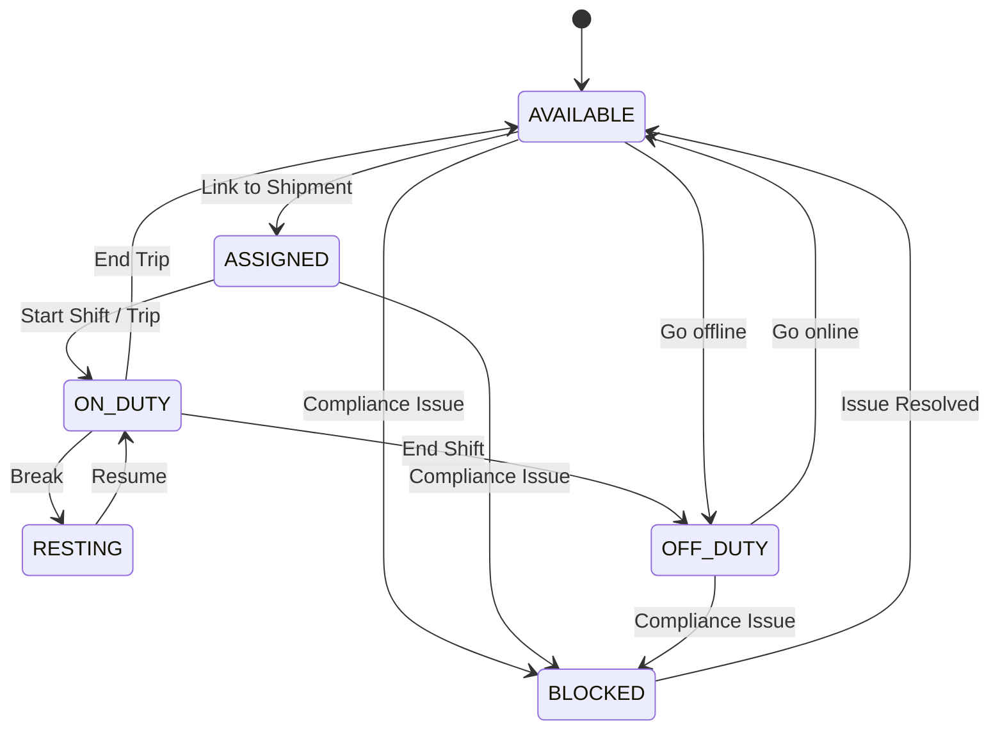

# Конечный автомат: Водитель (Driver)

## 1. Диаграмма состояний

## 2. Таблица состояний (States Definition)

| Код состояния | Бизнес-смысл                                 | Тип                       |
| ------------- | -------------------------------------------- | ------------------------- |
| `AVAILABLE`   | Доступен для назначения на рейс              | Начальное / Промежуточное |
| `ASSIGNED`    | Назначен на предстоящий рейс                 | Промежуточное             |
| `ON_DUTY`     | На смене, выполняет рейс                     | Промежуточное             |
| `RESTING`     | Перерыв / отдых в рамках смены (режим труда) | Промежуточное             |
| `OFF_DUTY`    | Вне смены, не работает                       | Промежуточное             |
| `BLOCKED`     | Заблокирован (истекли документы, нарушение)  | Промежуточное             |

## 3. Матрица переходов (Transition Matrix)

| Исходное → Целевое       | Инициатор     | Событие-триггер    | Предусловия                     | Эффекты               |
| ------------------------ | ------------- | ------------------ | ------------------------------- | --------------------- |
| `AVAILABLE` → `ASSIGNED` | Dispatcher    | Assign to Shipment | Лимиты рабочего времени в норме | Привязка к рейсу      |
| `ASSIGNED` → `ON_DUTY`   | Driver        | Start Trip         | -                               | Начало трекинга GPS   |
| `ON_DUTY` → `RESTING`    | Driver/System | Start Break        | Соблюдение тахографа            | Приостановка трекинга |
| `AVAILABLE` → `BLOCKED`  | System/Admin  | License Expired    | -                               | Снятие с рейсов       |

## 4. Обработка исключений

- Если водитель переходит в `BLOCKED`, система автоматически уведомляет диспетчера о необходимости замены водителя на рейсах в статусе `ASSIGNED`.
