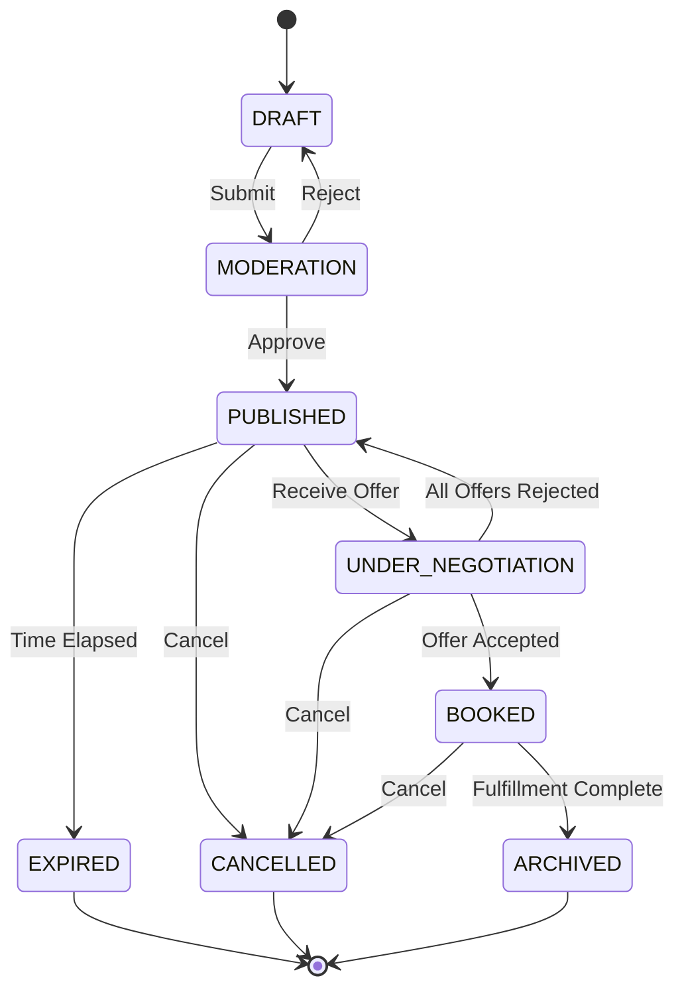

# Конечный автомат: Груз на маркетплейсе (Load)

## 1. Диаграмма состояний

## 2. Таблица состояний (States Definition)

| Код состояния       | Бизнес-смысл                                          | Тип           |
| ------------------- | ----------------------------------------------------- | ------------- |
| `DRAFT`             | Черновик заявки на груз, видим только создателю       | Начальное     |
| `MODERATION`        | Проверка модератором или системой скоринга            | Промежуточное |
| `PUBLISHED`         | Груз опубликован на бирже, доступен для просмотра     | Промежуточное |
| `UNDER_NEGOTIATION` | Идет процесс торга (поступили офферы от перевозчиков) | Промежуточное |
| `BOOKED`            | Груз забронирован, сформирован Transport Order        | Промежуточное |
| `ARCHIVED`          | Перевозка завершена, перенесен в архив                | Финальное     |
| `EXPIRED`           | Время актуальности (окно погрузки) истекло            | Финальное     |
| `CANCELLED`         | Грузоотправитель отменил заявку                       | Финальное     |

## 3. Матрица переходов (Transition Matrix)

| Исходное → Целевое                | Инициатор      | Событие-триггер | Предусловия                    | Эффекты                         |
| --------------------------------- | -------------- | --------------- | ------------------------------ | ------------------------------- |
| `DRAFT` → `MODERATION`            | Shipper        | Submit Load     | Заполнены обязательные поля    | Создается задача на модерацию   |
| `MODERATION` → `PUBLISHED`        | System / Admin | Approve         | Пройдена проверка безопасности | Рассылка уведомлений Carrier-ам |
| `PUBLISHED` → `UNDER_NEGOTIATION` | Carrier        | Submit Offer    | Нет активного торга            | Уведомление Shipper-а           |
| `UNDER_NEGOTIATION` → `BOOKED`    | Shipper        | Accept Offer    | Оффер принят                   | Создание Transport Order        |
| `PUBLISHED` → `EXPIRED`           | System         | Timeout         | Наступило время погрузки       | Снятие с публикации             |

## 4. Обработка исключительных сценариев

- Отмена: Если груз отменен после бронирования (`BOOKED`), применяются штрафные санкции (Cancellation Fee) в зависимости от времени до погрузки.
- Истечение срока: Переход в `EXPIRED` автоматически закрывает все активные офферы со статусом `REJECTED` (System reason).
