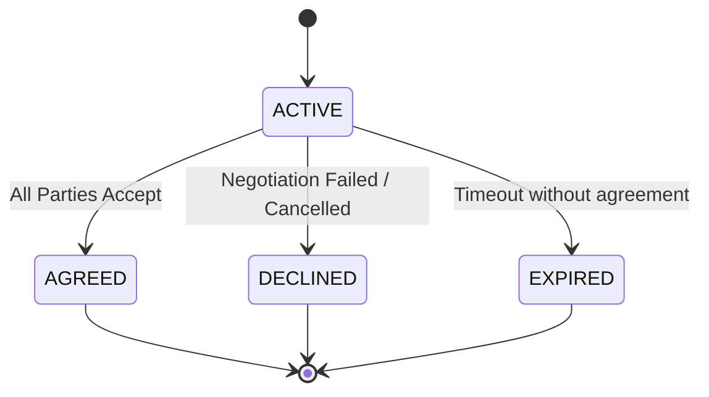

# Конечный автомат: Переговоры (Negotiation)

## 1. Диаграмма состояний

## 2. Таблица состояний (States Definition)

| Код состояния | Бизнес-смысл                                      | Тип       |
| ------------- | ------------------------------------------------- | --------- |
| `ACTIVE`      | Идет активный процесс переговоров по грузу        | Начальное |
| `AGREED`      | Переговоры завершены успешно, условия согласованы | Финальное |
| `DECLINED`    | Переговоры зашли в тупик или стороны отказались   | Финальное |
| `EXPIRED`     | Истекло время актуальности груза во время торга   | Финальное |

## 3. Матрица переходов (Transition Matrix)

| Исходное → Целевое    | Инициатор         | Событие-триггер | Предусловия                      | Эффекты                            |
| --------------------- | ----------------- | --------------- | -------------------------------- | ---------------------------------- |
| `ACTIVE` → `AGREED`   | Shipper / Carrier | Accept Offer    | Один из Offer перешел в ACCEPTED | Инициация создания Transport Order |
| `ACTIVE` → `DECLINED` | Shipper / Carrier | Reject All      | Все Offer отклонены              | Груз возвращается в PUBLISHED      |
| `ACTIVE` → `EXPIRED`  | System            | Time Elapsed    | Наступил дедлайн                 | Закрытие всех Offer                |

## 4. Обработка исключительных сценариев

- Если в ходе переговоров груз отменяется (`CANCELLED`), Negotiation переходит в `DECLINED`.
