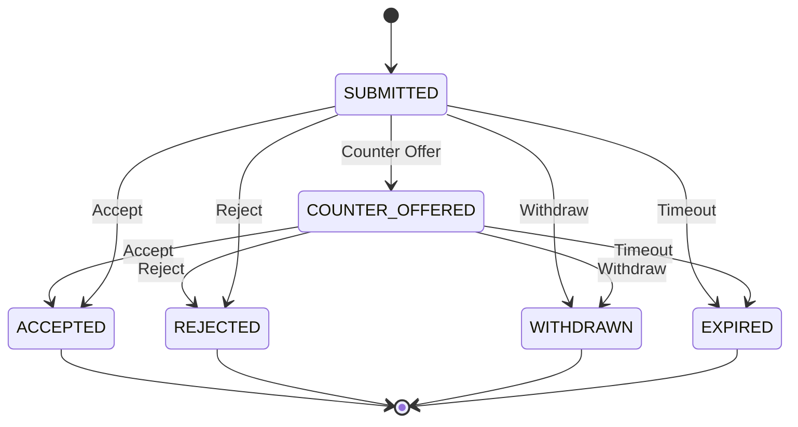

# Конечный автомат: Оффер (Offer)

## 1. Диаграмма состояний

## 2. Таблица состояний (States Definition)

| Код состояния     | Бизнес-смысл                                           | Тип           |
| ----------------- | ------------------------------------------------------ | ------------- |
| `SUBMITTED`       | Оффер отправлен другой стороне                         | Начальное     |
| `COUNTER_OFFERED` | Получено встречное предложение (изменение цены/сроков) | Промежуточное |
| `ACCEPTED`        | Оффер принят                                           | Финальное     |
| `REJECTED`        | Оффер отклонен                                         | Финальное     |
| `WITHDRAWN`       | Инициатор отозвал свой оффер                           | Финальное     |
| `EXPIRED`         | Время действия оффера истекло                          | Финальное     |

## 3. Матрица переходов (Transition Matrix)

| Исходное → Целевое              | Инициатор | Событие-триггер | Предусловия                      | Эффекты                                    |
| ------------------------------- | --------- | --------------- | -------------------------------- | ------------------------------------------ |
| `SUBMITTED` → `ACCEPTED`        | Recipient | Accept          | Груз в статусе UNDER_NEGOTIATION | Изменение статуса Negotiation, создание TO |
| `SUBMITTED` → `COUNTER_OFFERED` | Recipient | Submit Counter  | -                                | Уведомление инициатору                     |
| `SUBMITTED` → `WITHDRAWN`       | Initiator | Withdraw        | Не был принят                    | Оффер аннулируется                         |
| `SUBMITTED` → `EXPIRED`         | System    | TTL Expired     | Истек срок годности оффера       | -                                          |

## 4. Обработка исключений

- Если один оффер переходит в `ACCEPTED`, все остальные офферы в рамках торга по данному грузу автоматически переводятся в `REJECTED`.
