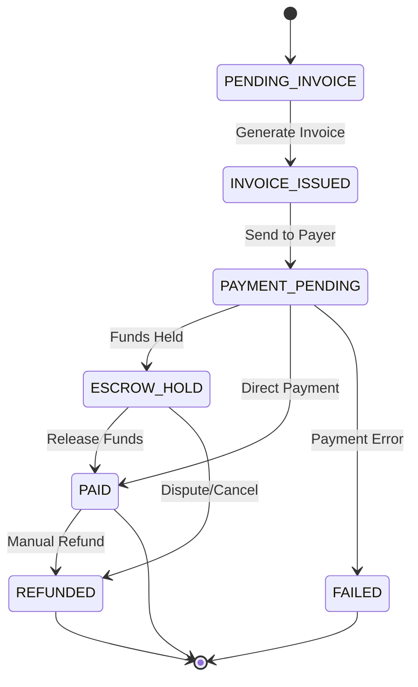

# Конечный автомат: Платежи (Payment)

## 1. Диаграмма состояний

## 2. Таблица состояний (States Definition)

| Код состояния     | Бизнес-смысл                                              | Тип           |
| ----------------- | --------------------------------------------------------- | ------------- |
| `PENDING_INVOICE` | Ожидание формирования счета                               | Начальное     |
| `INVOICE_ISSUED`  | Счет сгенерирован                                         | Промежуточное |
| `PAYMENT_PENDING` | Ожидание поступления средств                              | Промежуточное |
| `ESCROW_HOLD`     | Средства заморожены (холдированы) на платформе            | Промежуточное |
| `PAID`            | Оплата успешно проведена, средства у получателя           | Финальное     |
| `REFUNDED`        | Возврат средств плательщику                               | Финальное     |
| `FAILED`          | Ошибка проведения платежа (отказ банка, нехватка средств) | Финальное     |

## 3. Матрица переходов (Transition Matrix)

| Исходное → Целевое                   | Инициатор | Событие-триггер  | Предусловия              | Эффекты                 |
| ------------------------------------ | --------- | ---------------- | ------------------------ | ----------------------- |
| `PENDING_INVOICE` → `INVOICE_ISSUED` | System    | TO Fulfilled     | Есть реквизиты           | Инвойс в системе        |
| `INVOICE_ISSUED` → `PAYMENT_PENDING` | System    | Send Invoice     | -                        | Отправка по email/API   |
| `PAYMENT_PENDING` → `ESCROW_HOLD`    | Gateway   | Funds Authorized | Если используется escrow | Блокировка суммы        |
| `ESCROW_HOLD` → `PAID`               | System    | Release Trigger  | Отсутствие споров        | Зачисление Carrier-у    |
| `PAYMENT_PENDING` → `FAILED`         | Gateway   | Declined         | -                        | Уведомление плательщика |

## 4. Обработка исключений

- Возвраты (`REFUNDED`) осуществляются только администратором или автоматически при отмене заказа до выполнения (Cancellation) в рамках холдирования (`ESCROW_HOLD`).
