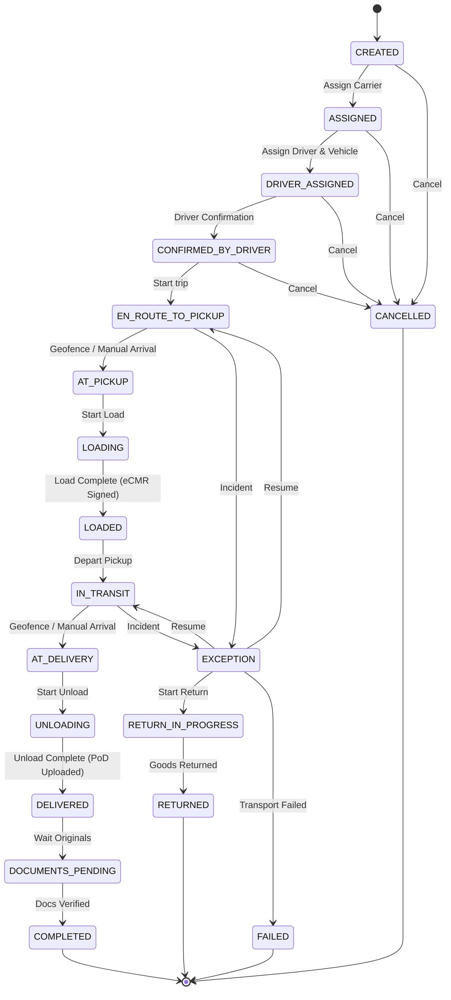

# Конечный автомат: Физическая перевозка (Shipment)

## 1. Диаграмма состояний

## 2. Таблица состояний (States Definition)

| Код состояния         | Бизнес-смысл                                      | Тип           |
| --------------------- | ------------------------------------------------- | ------------- |
| `CREATED`             | Перевозка создана, но исполнитель еще не назначен | Начальное     |
| `ASSIGNED`            | Назначена транспортная компания (Carrier)         | Промежуточное |
| `DRIVER_ASSIGNED`     | Выделен конкретный водитель и тягач               | Промежуточное |
| `CONFIRMED_BY_DRIVER` | Водитель подтвердил принятие рейса                | Промежуточное |
| `EN_ROUTE_TO_PICKUP`  | ТС на пути к точке погрузки                       | Промежуточное |
| `AT_PICKUP`           | Прибыл на склад погрузки                          | Промежуточное |
| `LOADING`             | Идет процесс погрузки                             | Промежуточное |
| `LOADED`              | Погрузка завершена, eCMR подписана                | Промежуточное |
| `IN_TRANSIT`          | В пути к точке выгрузки                           | Промежуточное |
| `AT_DELIVERY`         | Прибыл на точку выгрузки                          | Промежуточное |
| `UNLOADING`           | Идет процесс выгрузки                             | Промежуточное |
| `DELIVERED`           | Выгрузка завершена, фото PoD передано             | Промежуточное |
| `DOCUMENTS_PENDING`   | Ожидаются оригиналы / финальное подписание eCMR   | Промежуточное |
| `COMPLETED`           | Рейс успешно закрыт                               | Финальное     |
| `EXCEPTION`           | ДТП, поломка ТС, простой > нормы                  | Промежуточное |
| `CANCELLED`           | Отмена рейса до начала выполнения                 | Финальное     |
| `FAILED`              | Срыв доставки                                     | Финальное     |
| `RETURN_IN_PROGRESS`  | Возврат груза отправителю                         | Промежуточное |
| `RETURNED`            | Груз возвращен                                    | Финальное     |

## 3. Матрица переходов (Transition Matrix)

| Исходное → Целевое                        | Инициатор          | Событие-триггер       | Предусловия              | Эффекты                |
| ----------------------------------------- | ------------------ | --------------------- | ------------------------ | ---------------------- |
| `CREATED` → `ASSIGNED`                    | System             | Order Activated       | -                        | Notify Carrier         |
| `ASSIGNED` → `DRIVER_ASSIGNED`            | Carrier/Dispatcher | Assign Driver/Vehicle | Доступны водитель и ТС   | Notify Driver          |
| `DRIVER_ASSIGNED` → `CONFIRMED_BY_DRIVER` | Driver             | Confirm Trip          | -                        | Notify Dispatcher      |
| `EN_ROUTE_TO_PICKUP` → `AT_PICKUP`        | System/Driver      | Geofence triggered    | Координаты совпадают     | Notify Warehouse       |
| `LOADED` → `IN_TRANSIT`                   | Driver             | Depart                | Подписана eCMR (отправ.) | Уведомление получателю |
| `DELIVERED` → `DOCUMENTS_PENDING`         | System             | Delivery Confirmed    | Загружены фото/сканы     | Сверка доков           |

## 4. Обработка исключительных сценариев

- **Auto-transitions:** Переходы в `AT_PICKUP` и `AT_DELIVERY` могут выполняться платформой автоматически при срабатывании геозон.
- **Manual Overrides:** Диспетчер может вручную переводить статусы, если водитель потерял связь или сломался девайс.
- **Returns:** При отказе от груза на выгрузке, статус переходит в `EXCEPTION`, затем в `RETURN_IN_PROGRESS`. При успешном возврате на склад — `RETURNED`.
