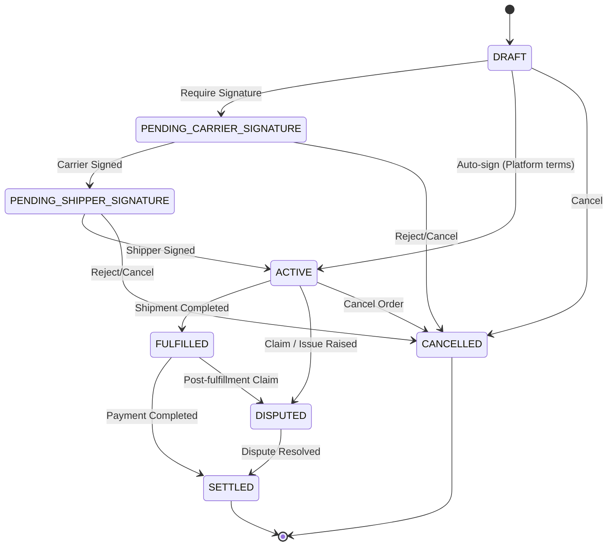

# Конечный автомат: Транспортный заказ (Transport Order)

## 1. Диаграмма состояний

## 2. Таблица состояний (States Definition)

| Код состояния               | Бизнес-смысл                                   | Тип           |
| --------------------------- | ---------------------------------------------- | ------------- |
| `DRAFT`                     | Заказ сформирован, ожидает процессинга         | Начальное     |
| `PENDING_CARRIER_SIGNATURE` | Ожидает подписи перевозчика (опционально)      | Промежуточное |
| `PENDING_SHIPPER_SIGNATURE` | Ожидает подписи грузоотправителя (опционально) | Промежуточное |
| `ACTIVE`                    | Юридический договор вступил в силу             | Промежуточное |
| `FULFILLED`                 | Обязательства по перевозке выполнены           | Промежуточное |
| `SETTLED`                   | Взаиморасчеты завершены, сделка закрыта        | Финальное     |
| `DISPUTED`                  | Открыт спор (претензия) по заказу              | Промежуточное |
| `CANCELLED`                 | Заказ аннулирован                              | Финальное     |

## 3. Матрица переходов (Transition Matrix)

| Исходное → Целевое                                        | Инициатор       | Событие-триггер    | Предусловия                  | Эффекты              |
| --------------------------------------------------------- | --------------- | ------------------ | ---------------------------- | -------------------- |
| `DRAFT` → `ACTIVE`                                        | System          | Agree to terms     | Платформенная оферта         | Создание Shipment    |
| `PENDING_CARRIER_SIGNATURE` → `PENDING_SHIPPER_SIGNATURE` | Carrier         | Sign Contract      | -                            | Уведомление Shipper  |
| `PENDING_SHIPPER_SIGNATURE` → `ACTIVE`                    | Shipper         | Sign Contract      | -                            | Создание Shipment    |
| `ACTIVE` → `FULFILLED`                                    | System          | Shipment Completed | Shipment перешел в COMPLETED | Формирование Инвойса |
| `FULFILLED` → `SETTLED`                                   | System          | Payment Confirmed  | Статус Payment = PAID        | -                    |
| `ACTIVE` → `DISPUTED`                                     | Shipper/Carrier | Raise Dispute      | -                            | Заморозка платежа    |

## 4. Обработка исключений

- Разрешение спора: Из `DISPUTED` переход в `SETTLED` происходит после резолюции модератора или арбитража. Возможны частичные возвраты (Refunds).
