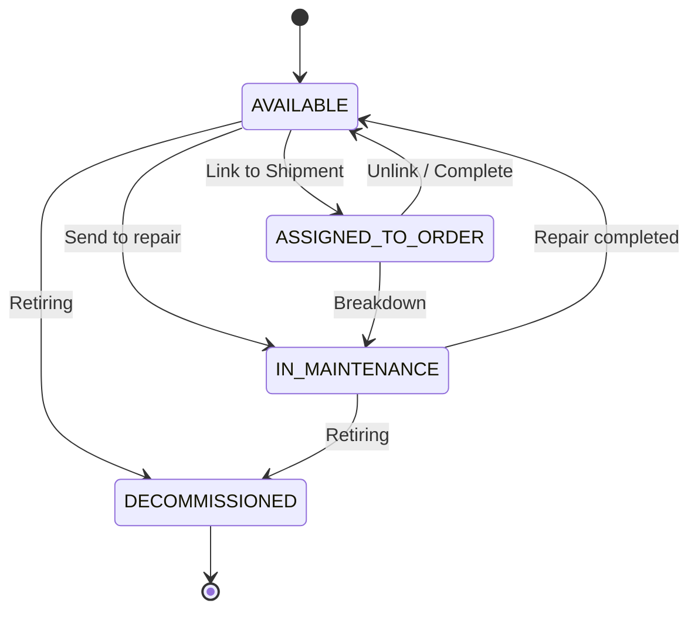

# Конечный автомат: Транспортное средство (Vehicle)

## 1. Диаграмма состояний

## 2. Таблица состояний (States Definition)

| Код состояния       | Бизнес-смысл                  | Тип                       |
| ------------------- | ----------------------------- | ------------------------- |
| `AVAILABLE`         | Исправно и готово к работе    | Начальное / Промежуточное |
| `ASSIGNED_TO_ORDER` | Задействовано в рейсе         | Промежуточное             |
| `IN_MAINTENANCE`    | Находится на ТО или в ремонте | Промежуточное             |
| `DECOMMISSIONED`    | Списано или продано           | Финальное                 |

## 3. Матрица переходов (Transition Matrix)

| Исходное → Целевое                     | Инициатор  | Событие-триггер  | Предусловия         | Эффекты                     |
| -------------------------------------- | ---------- | ---------------- | ------------------- | --------------------------- |
| `AVAILABLE` → `ASSIGNED_TO_ORDER`      | Dispatcher | Assign           | ТС не в ремонте     | Связь с Shipment            |
| `ASSIGNED_TO_ORDER` → `IN_MAINTENANCE` | Driver     | Report Breakdown | Внештатная ситуация | Вызов эвакуатора, замена ТС |
| `IN_MAINTENANCE` → `AVAILABLE`         | Mechanic   | Repair Done      | -                   | ТС доступно для диспетчера  |

## 4. Обработка исключений

- Поломка во время рейса (`ASSIGNED_TO_ORDER` → `IN_MAINTENANCE`) инициирует событие `EXCEPTION` в автомате соответствующего `Shipment` для поиска подменного тягача/прицепа.
