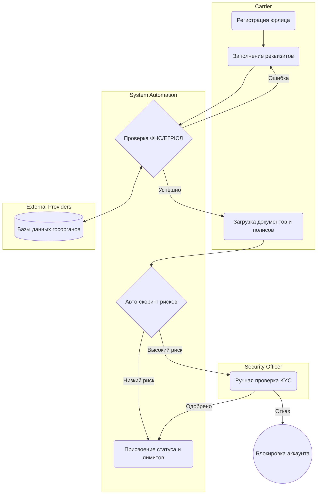

# Онбординг Перевозчика (Carrier Onboarding)

## Цель и бизнес-контекст процесса

Обеспечить безопасное подключение новых транспортных компаний к платформе, исключить мошенничество (фирмы-однодневки), проверить наличие необходимых лицензий и страховых полисов (KYC), а также присвоить начальные лимиты.

## Участники и роли

- **Carrier (Перевозчик)**: регистрируется, предоставляет документы.
- **System Automations (Платформа)**: валидирует данные через внешние реестры, скорит профиль.
- **Security Officer (Служба безопасности)**: принимает финальное решение по спорным анкетам.
- **External Providers (ФНС, ЕГРЮЛ, Страховые БД)**: источники данных для проверки.

## Диаграмма процесса (BPMN-стиль)

## Спецификация шагов процесса

### 1. Регистрация и ввод реквизитов

- **Входные данные**: ИНН/ОГРН, контактные данные.
- **Ответственная роль**: Carrier.
- **Действие**: Создание учетной записи, ввод базовой информации о компании.
- **Возможные точки отказа**: ИНН уже зарегистрирован в системе.

### 2. Автоматическая проверка (ФНС/ЕГРЮЛ)

- **Входные данные**: ИНН/ОГРН.
- **Ответственная роль**: System Automations / External Providers.
- **Действие**: Запрос в государственные реестры для проверки статуса компании (не в стадии ликвидации/банкротства), даты регистрации, совпадения ФИО гендиректора.
- **Создаваемые доменные события**: `CompanyDataVerified`, `CompanyVerificationFailed`.
- **Возможные точки отказа**: Недоступность сервисов ФНС (Downtime).

### 3. Загрузка документов

- **Входные данные**: Сканы устава, свидетельств, страховых полисов (CMR-страхование), водительских удостоверений.
- **Ответственная роль**: Carrier.
- **Действие**: Загрузка файлов в систему через интерфейс.
- **Возможные точки отказа**: Файлы нечитаемы, превышен размер файлов.

### 4. Авто-скоринг и Ручная проверка (KYC)

- **Входные данные**: Загруженные документы, данные профиля, данные из парсинга реестров.
- **Ответственная роль**: System Automations / Security Officer.
- **Действие**: Платформа проверяет срок действия полисов (с помощью OCR/AI) и возраст компании. При выявлении признаков риска (например, компания зарегистрирована 2 месяца назад) заявка падает в очередь ручной проверки сотруднику СБ.
- **Возможные точки отказа**: Подозрение на подделку документов (отказ в регистрации).

### 5. Присвоение статуса и лимитов

- **Входные данные**: Одобренная анкета.
- **Ответственная роль**: System Automations.
- **Действие**: Активация аккаунта. Присвоение статуса верификации (`VERIFIED`). Установка начальных финансовых и количественных лимитов (например, не более 3 активных заказов одновременно).
- **Создаваемые доменные события**: `CarrierOnboarded`, `LimitsAssigned`.
