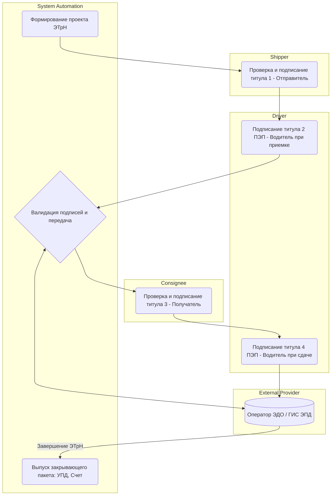

# Электронный Документооборот (Document Flow)

## Цель и бизнес-контекст процесса

Обеспечить полный цикл безбумажного юридически значимого документооборота (ЮЗДО) на всех этапах перевозки: от оформления ЭТрН до обмена закрывающими финансовыми документами (УПД, Счета). Это ускоряет процессы оплаты и снижает риски утери документов.

## Участники и роли

- **Shipper (Грузоотправитель)**: подписывает ЭТрН при отгрузке.
- **Driver (Водитель)**: подписывает ЭТрН (ПЭП) при приемке и сдаче груза.
- **Consignee (Грузополучатель)**: подписывает ЭТрН при выгрузке.
- **System Automations (Платформа)**: генерирует черновики документов, отслеживает статусы подписания, формирует закрывающий пакет.
- **External Providers (Оператор ЭДО / ГИС ЭПД)**: обеспечивает легитимность ЭП, фиксирует факты передачи, передает данные в государственные системы.

## Диаграмма процесса (BPMN-стиль)

## Спецификация шагов процесса

### 1. Формирование проекта ЭТрН

- **Входные данные**: Данные заказа (маршрут, ТС, водитель, номенклатура).
- **Ответственная роль**: System Automations.
- **Действие**: Генерация XML файла (Титул 1) по установленному формату ФНС.
- **Возможные точки отказа**: Отсутствие обязательных полей для XML схемы.

### 2. Подписание при погрузке (Титулы 1 и 2)

- **Входные данные**: Проект ЭТрН.
- **Ответственная роль**: Shipper / Driver.
- **Действие**: Грузоотправитель подписывает документ УКЭП/УНЭП. Водитель через мобильное приложение подтверждает приемку груза (формирование Титула 2) посредством простой электронной подписи (ПЭП).
- **Создаваемые доменные события**: `EcmrSignedByShipper`, `EcmrSignedByDriverPickUp`.
- **Возможные точки отказа**: Проблемы с сертификатом ЭП у отправителя, отсутствие интернета у водителя.

### 3. Передача в ГИС ЭПД

- **Входные данные**: Подписанные Титулы 1 и 2.
- **Ответственная роль**: External Providers.
- **Действие**: Оператор ЭДО фиксирует транзакцию и передает данные в государственную информационную систему электронных перевозочных документов (ГИС ЭПД).
- **Возможные точки отказа**: Сбой на стороне оператора ЭДО или шлюза ГИС ЭПД.

### 4. Подписание при выгрузке (Титулы 3 и 4)

- **Входные данные**: Прибытие на выгрузку, ЭТрН с Титулами 1-2.
- **Ответственная роль**: Consignee / Driver.
- **Действие**: Грузополучатель проверяет груз и подписывает Титул 3 (КЭП). Водитель подтверждает сдачу груза (Титул 4, ПЭП).
- **Создаваемые доменные события**: `EcmrSignedByConsignee`, `EcmrSignedByDriverDropOff`.
- **Возможные точки отказа**: Обнаружение брака/недостачи (необходимость формирования актов расхождений перед подписанием).

### 5. Выпуск закрывающего пакета

- **Входные данные**: Завершенный цикл подписания ЭТрН.
- **Ответственная роль**: System Automations.
- **Действие**: Автоматическая генерация Универсального передаточного документа (УПД), акта выполненных работ и счета на оплату. Направление пакета в ЭДО.
- **Создаваемые доменные события**: `ClosingDocumentsGenerated`.
