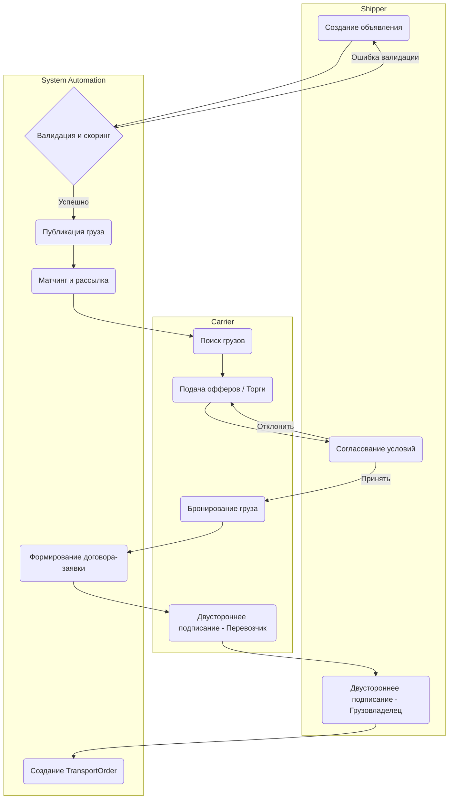

# Создание Транспортного Заказа (Load to Order)

## Цель и бизнес-контекст процесса

Обеспечить публикацию груза грузовладельцем, подбор подходящего перевозчика (через торги или прямые предложения) и юридически значимое оформление транспортного заказа (Договор-заявка).

## Участники и роли

- **Shipper (Грузовладелец / Экспедитор)**: создает и публикует груз.
- **Carrier / Dispatcher (Перевозчик / Диспетчер)**: ищет грузы, делает ставки, подписывает договор.
- **System Automations (Платформа)**: валидирует, рассчитывает скоринг, подбирает варианты (матчинг), формирует документы.
- **External Providers (Провайдер ЭДО)**: обеспечивает подписание электронных документов.

## Диаграмма процесса (BPMN-стиль)

## Спецификация шагов процесса

### 1. Создание объявления

- **Входные данные**: Информация о грузе (вес, объем, тип), маршрут (точки А и Б), даты погрузки/выгрузки, требуемый тип ТС.
- **Ответственная роль**: Shipper.
- **Действие**: Заполнение формы груза и отправка на публикацию.
- **Возможные точки отказа**: Некорректно заполнены обязательные поля.

### 2. Валидация и скоринг

- **Входные данные**: Черновик груза (Draft Load).
- **Ответственная роль**: System Automations.
- **Действие**: Проверка лимитов грузовладельца, расчет рекомендуемой цены (Pricing Engine).
- **Создаваемые доменные события**: `LoadValidated`, `LoadValidationFailed`.
- **Возможные точки отказа**: Превышение кредитного лимита, отсутствие необходимых документов.

### 3. Публикация и Матчинг

- **Входные данные**: Валидированный груз.
- **Ответственная роль**: System Automations.
- **Действие**: Перевод груза в статус `PUBLISHED`. Поиск подходящих перевозчиков по радиусу и типу ТС, отправка уведомлений.
- **Создаваемые доменные события**: `LoadPublished`, `MatchesFound`.

### 4. Подача офферов / Торги

- **Входные данные**: Опубликованный груз.
- **Ответственная роль**: Carrier.
- **Действие**: Перевозчик предлагает свою ставку или соглашается на цену отправителя.
- **Возможные точки отказа**: Груз уже забронирован другим перевозчиком.

### 5. Согласование условий и Бронирование

- **Входные данные**: Поданный оффер.
- **Ответственная роль**: Shipper / Carrier.
- **Действие**: Shipper принимает ставку Carrier, Carrier бронирует груз под конкретное ТС и водителя.
- **Создаваемые доменные события**: `OfferAccepted`, `LoadBooked`.
- **Возможные точки отказа**: Carrier не успел назначить ТС в отведенное время (таймаут бронирования).

### 6. Формирование договора-заявки и Подписание

- **Входные данные**: Подтвержденная бронь с данными ТС и водителя.
- **Ответственная роль**: System Automations / Shipper / Carrier / External Providers.
- **Действие**: Платформа генерирует PDF договора-заявки. Стороны подписывают документ ПЭП или КЭП через провайдера ЭДО.
- **Возможные точки отказа**: Отказ одной из сторон от подписания, сбой на стороне провайдера ЭДО.

### 7. Создание TransportOrder

- **Входные данные**: Подписанный договор-заявка.
- **Ответственная роль**: System Automations.
- **Действие**: Генерация сущности заказа на перевозку, перевод груза в статус `ASSIGNED`.
- **Создаваемые доменные события**: `TransportOrderCreated`.
