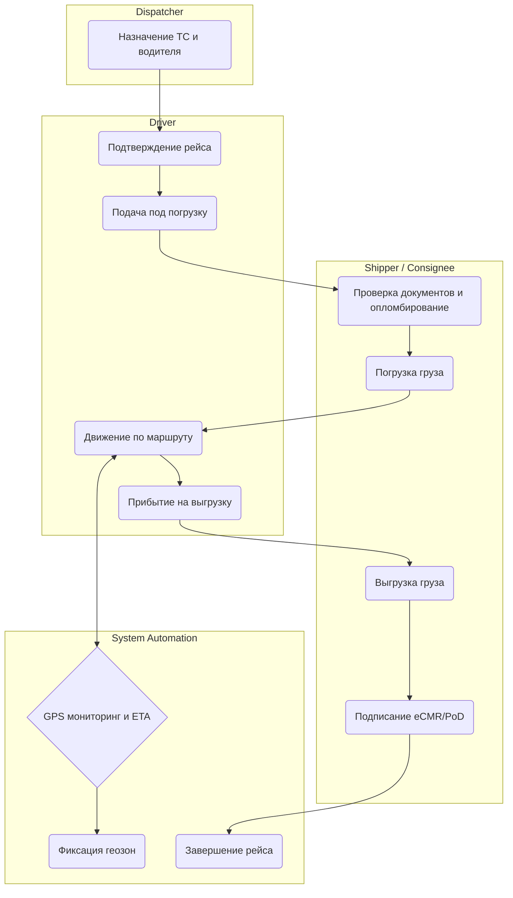

# Исполнение Перевозки (Order Execution)

## Цель и бизнес-контекст процесса

Обеспечить прозрачный контроль за физическим исполнением транспортного заказа от момента назначения машины до успешной выгрузки и подписания закрывающих документов (eCMR/PoD).

## Участники и роли

- **Dispatcher (Диспетчер)**: назначает конкретное ТС и водителя.
- **Driver (Водитель)**: выполняет рейс, отмечает статусы, предоставляет GPS трек, подписывает ЭТрН.
- **Shipper / Consignee (Грузоотправитель / Грузополучатель)**: передает/принимает груз, подписывает ЭТрН.
- **System Automations (Платформа)**: мониторит геопозицию, рассчитывает ETA, фиксирует прохождение геозон (Geofencing), управляет стейт-машиной заказа.

## Диаграмма процесса (BPMN-стиль)

## Спецификация шагов процесса

### 1. Назначение ТС и водителя

- **Входные данные**: Созданный `TransportOrder`.
- **Ответственная роль**: Dispatcher.
- **Действие**: Выбор ТС из автопарка и назначение водителя на рейс.
- **Создаваемые доменные события**: `DriverAssigned`, `VehicleAssigned`.
- **Возможные точки отказа**: Водитель или ТС не прошли проверку (просрочены документы).

### 2. Подтверждение водителем

- **Входные данные**: Push-уведомление в мобильном приложении.
- **Ответственная роль**: Driver.
- **Действие**: Ознакомление с деталями заказа, подтверждение готовности к рейсу.
- **Возможные точки отказа**: Таймаут ожидания ответа водителя (срыв рейса).

### 3. Подача под погрузку и Погрузка

- **Входные данные**: Подтвержденный заказ.
- **Ответственная роль**: Driver / Shipper.
- **Действие**: Прибытие на точку (автоматически фиксируется по GPS). Проверка грузоотправителем документов, физическая погрузка, опломбирование.
- **Возможные точки отказа**: Опоздание водителя, отказ в погрузке из-за грязного кузова.

### 4. Движение по маршруту

- **Входные данные**: Статус `IN_TRANSIT`.
- **Ответственная роль**: Driver / System Automations.
- **Действие**: Передача GPS координат, прохождение промежуточных контрольных точек (Geofencing), автоматический перерасчет ETA.
- **Создаваемые доменные события**: `LocationUpdated`, `WaypointPassed`.
- **Возможные точки отказа**: Потеря связи с GPS-трекером, поломка ТС (Breakdown).

### 5. Выгрузка и Закрытие рейса

- **Входные данные**: Прибытие на точку выгрузки.
- **Ответственная роль**: Driver / Consignee / System Automations.
- **Действие**: Выгрузка товара, проверка на отсутствие повреждений. Двустороннее подписание ЭТрН / загрузка фото бумажной ТрН (PoD). Платформа фиксирует успешное завершение рейса.
- **Создаваемые доменные события**: `DeliveryCompleted`, `PodUploaded`.
- **Возможные точки отказа**: Недостача/порча груза (составление акта расхождений), отказ грузополучателя.
