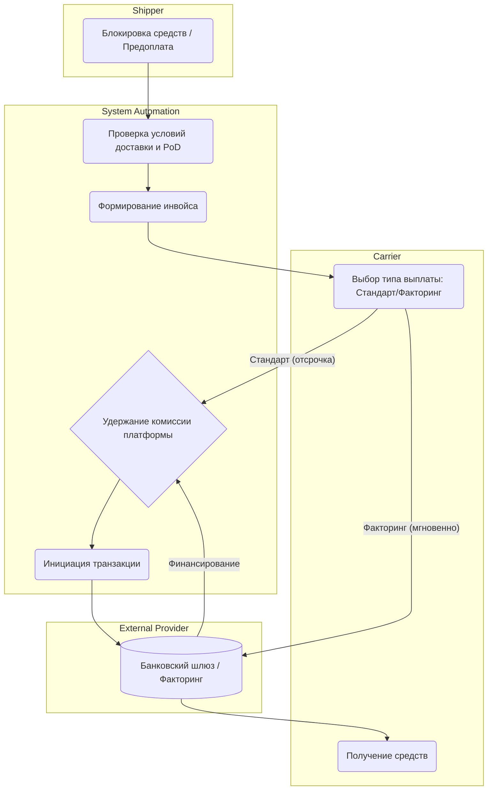

# Финансовые Взаиморасчеты и Факторинг (Payment Flow)

## Цель и бизнес-контекст процесса

Обеспечить своевременную и точную оплату услуг перевозчиков, автоматизировать удержание комиссии платформы и предоставить инструменты для ускорения выплат (цифровой факторинг) для повышения лояльности перевозчиков.

## Участники и роли

- **Shipper (Грузовладелец)**: пополняет баланс, оплачивает счета.
- **Carrier (Перевозчик)**: получает выплату, запрашивает раннюю оплату.
- **System Automations (Billing / Платформа)**: рассчитывает комиссии, формирует инвойсы, управляет эскроу-счетами.
- **External Providers (Банк / Факторинговая компания)**: проводит платежи, предоставляет финансирование.

## Диаграмма процесса (BPMN-стиль)

## Спецификация шагов процесса

### 1. Блокировка средств (Escrow) или Проверка лимитов

- **Входные данные**: Созданный заказ (TransportOrder).
- **Ответственная роль**: System Automations / Shipper.
- **Действие**: При работе по предоплате средства холдируются (блокируются) на счете грузовладельца. При работе по постоплате проверяется доступный кредитный лимит.
- **Возможные точки отказа**: Недостаточно средств на балансе, исчерпан кредитный лимит.

### 2. Проверка условий доставки (PoD)

- **Входные данные**: Успешно завершенный рейс, загруженные и валидированные закрывающие документы (ЭТрН/PoD).
- **Ответственная роль**: System Automations.
- **Действие**: Проверка отсутствия претензий (штрафов, актов о порче груза).
- **Создаваемые доменные события**: `DeliveryVerifiedForPayment`.
- **Возможные точки отказа**: Наличие незакрытой претензии приостанавливает выплату до разрешения спора.

### 3. Формирование инвойса и Выбор типа выплаты

- **Входные данные**: Проверенный заказ.
- **Ответственная роль**: System Automations / Carrier.
- **Действие**: Платформа генерирует итоговый счет. Перевозчик в личном кабинете видит доступную сумму и выбирает метод получения (дожидаться стандартной отсрочки платежа от грузовладельца или запросить досрочную выплату через факторинг с удержанием дополнительной комиссии).
- **Возможные точки отказа**: Carrier не прошел KYC у факторинговой компании.

### 4. Удержание комиссии и Транзакция

- **Входные данные**: Выбранный метод выплаты.
- **Ответственная роль**: System Automations / External Providers.
- **Действие**: Billing system рассчитывает комиссию платформы. Формируются платежные поручения по API в банк: списание с холдированного счета грузовладельца (или перевод от фактора) -> счет перевозчика (минус комиссия) и счет платформы (комиссия).
- **Создаваемые доменные события**: `InvoicePaid`, `CommissionDeducted`.
- **Возможные точки отказа**: Сбой банковского шлюза (Bank API timeout).

### 5. Зачисление средств

- **Входные данные**: Подтверждение от банка.
- **Ответственная роль**: External Providers / Carrier.
- **Действие**: Обновление балансов в системе, получение средств перевозчиком.
- **Создаваемые доменные события**: `PayoutCompleted`.
