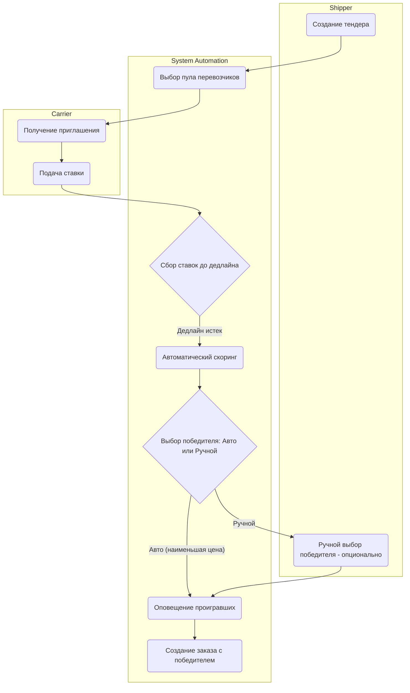

# Проведение Тендера (Tender Workflow)

## Цель и бизнес-контекст процесса

Обеспечить конкурентный выбор перевозчика для перевозки груза на заданных условиях через механизм закрытых или открытых торгов, минимизируя транспортные расходы грузовладельца.

## Участники и роли

- **Shipper (Грузовладелец / Экспедитор)**: инициирует тендер, устанавливает правила и дедлайн.
- **Carrier (Перевозчики)**: получают приглашения, подают ставки.
- **System Automations (Платформа)**: рассылает приглашения, скрывает ставки конкурентов (если требуется), скорит предложения, автоматически выбирает победителя по заданным правилам.

## Диаграмма процесса (BPMN-стиль)

## Спецификация шагов процесса

### 1. Создание тендера

- **Входные данные**: Информация о грузе, параметры тендера (закрытый/открытый пул, дедлайн приема ставок, шаг торгов, тип выбора победителя: авто/ручной).
- **Ответственная роль**: Shipper.
- **Действие**: Формирование заявки на тендер и её публикация.
- **Возможные точки отказа**: Некорректно установлен дедлайн (прошлое время).

### 2. Выбор пула перевозчиков и Рассылка

- **Входные данные**: Параметры тендера.
- **Ответственная роль**: System Automations.
- **Действие**: Формирование списка приглашенных перевозчиков (из белого списка или общая рассылка по радиусу), отправка push/email уведомлений.
- **Создаваемые доменные события**: `TenderPublished`, `TenderInvitationsSent`.

### 3. Сбор ставок

- **Входные данные**: Активный тендер.
- **Ответственная роль**: Carrier / System Automations.
- **Действие**: Перевозчики отправляют ставки. Платформа проверяет их валидность (ставка меньше максимальной, шаг торгов соблюден). При слепых торгах ставки других скрыты.
- **Создаваемые доменные события**: `BidPlaced`.
- **Возможные точки отказа**: Перевозчик не имеет требуемого рейтинга для участия.

### 4. Скоринг и Выбор победителя

- **Входные данные**: Список собранных ставок после наступления дедлайна.
- **Ответственная роль**: System Automations / Shipper.
- **Действие**: Если установлен автовыбор — платформа выбирает ставку с наименьшей ценой (с учетом рейтинга надежности). Если ручной — грузоотправитель сам выбирает победителя из отсортированного списка.
- **Создаваемые доменные события**: `TenderWinnerSelected`.
- **Возможные точки отказа**: Ни одной ставки не подано (тендер признается несостоявшимся).

### 5. Оповещение и Создание заказа

- **Входные данные**: Выбранный победитель.
- **Ответственная роль**: System Automations.
- **Действие**: Автоматическая рассылка отказов проигравшим участникам. Запуск процесса формирования договора-заявки с победителем (переход в стандартный Workflow Load-to-Order).
- **Создаваемые доменные события**: `TenderClosed`, `TenderLosersNotified`.
