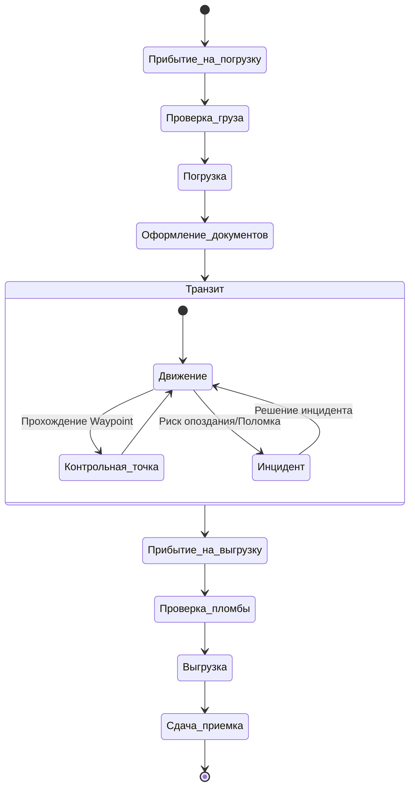

# Интерфейс и логика трекинга рейса

## Real-time Visibility для участников

- **Видение Грузовладельца**: Предоставляется доступ к интерактивной карте в личном кабинете. На карте отображается: положение ТС, пройденный трек, текущая скорость, динамический ETA, текущий статус рейса и журнал событий (лог изменений).
- **Публичная ссылка (Public Tracking Link)**: Возможность генерации Shareable URL для третьих лиц (например, грузополучателей). Ссылка дает ограниченный доступ к статусу груза и ETA без необходимости авторизации в системе.

## Механизмы оповещений диспетчера (Proactive Alerts)

Система генерирует проактивные алерты для оперативного реагирования логиста/диспетчера:

- **Риск опоздания**: `«Риск опоздания на выгрузку > 60 мин»` (срабатывает при пересчете ETA).
- **Отклонение от маршрута**: `«Отклонение от маршрута > 10 км»` (выход за пределы разрешенного коридора).
- **Длительная остановка**: `«Остановка в пути вне разрешенных стоянок > 2 часов»`.
- **Потеря сигнала**: `«Потеря связи с GPS-трекером > 30 минут»`.

## Архитектурный мост

Сущность перевозки `Shipment` (из логистического домена) интегрируется с телематическим сервисом `Location & Telematics Context`. Мост обеспечивает маппинг телематических данных (координаты, скорость, температура) на бизнес-события конкретного рейса.

## Процесс движения от погрузки до сдачи

