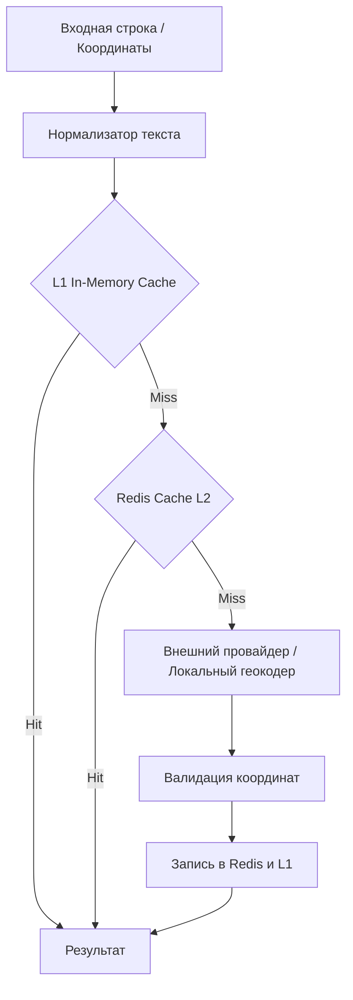

# Прямое и обратное геокодирование

## Обзор

Сервис геокодирования (`Geocoding Service`) отвечает за преобразование текстовых адресов в географические координаты (прямое геокодирование) и обратное преобразование координат в человекочитаемый адрес (обратное геокодирование). Это критичный компонент для построения маршрутов и поиска локаций.

## Пайплайн геокодирования

Процесс геокодирования оптимизирован для снижения нагрузки на внешние платные API и обеспечения минимальной задержки (low latency) с помощью многоуровневого кэширования.

1. **Нормализатор**: Очистка входной строки (удаление лишних пробелов, спецсимволов, приведение сокращений ул., г., д. к стандарту).
2. **L1 In-Memory / Redis Cache L2**:
   - Поиск в кэше осуществляется по MD5-хешу от нормализованной строки (для прямого) или округленным до 4 знаков координатам (для обратного).
   - Redis обеспечивает распределенный кэш (TTL 30-90 дней для адресов).
3. **L2 Геокодер (Провайдеры)**:
   - Интеграция через интерфейс адаптера с различными провайдерами: `DaData` (приоритет для РФ), `Yandex Maps API`, `OpenStreetMap Nominatim` (в качестве бесплатной/локальной альтернативы).
4. **Валидация координат**:
   - Проверка, что полученные координаты находятся в пределах ожидаемого региона или страны (Bounding Box check).
   - Отсев явных аномалий (например, 0,0 - Null Island).

## Fallback-стратегия и Circuit Breaker

Внешние API геокодинга могут быть недоступны, иметь лимиты RPS или отвечать с задержками.

- **Circuit Breaker**: Если выбранный основной провайдер (например, DaData) возвращает ошибки 5xx или превышает таймаут (напр. > 2 сек) в $X$% запросов, срабатывает Circuit Breaker.
- **Fallback**: Трафик автоматически переключается на резервного провайдера (например, Yandex или локально развернутый Nominatim).
- **Graceful Degradation**: В случае полной недоступности всех провайдеров система отдает старые кэшированные (stale) данные (используя stale-while-revalidate паттерн) или просит пользователя уточнить положение на карте вручную (Drop Pin).
