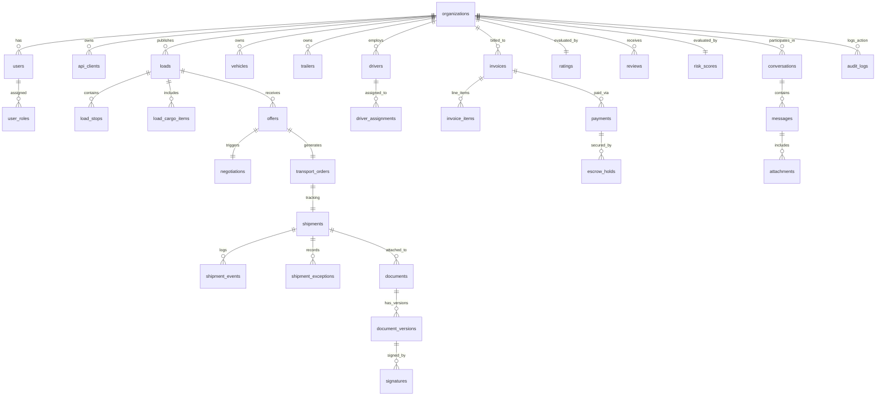

# Полная ER-диаграмма платформы

```mermaid
erDiagram
    %% IAM
    organizations ||--o{ users : has
    users ||--o{ user_roles : assigned
    organizations ||--o{ api_clients : owns
    
    %% Marketplace
    organizations ||--o{ loads : publishes
    loads ||--o{ load_stops : contains
    loads ||--o{ load_cargo_items : includes
    
    %% Negotiation
    loads ||--o{ offers : receives
    offers ||--|| negotiations : triggers
    
    %% Transport
    offers ||--|| transport_orders : generates
    transport_orders ||--|| shipments : tracking
    shipments ||--o{ shipment_events : logs
    shipments ||--o{ shipment_exceptions : records
    
    %% Fleet
    organizations ||--o{ vehicles : owns
    organizations ||--o{ trailers : owns
    organizations ||--o{ drivers : employs
    drivers ||--o{ driver_assignments : assigned_to
    
    %% Documents
    shipments ||--o{ documents : attached_to
    documents ||--o{ document_versions : has_versions
    document_versions ||--o{ signatures : signed_by
    
    %% Finance
    organizations ||--o{ invoices : billed_to
    invoices ||--o{ invoice_items : line_items
    invoices ||--o{ payments : paid_via
    payments ||--o{ escrow_holds : secured_by
    
    %% Trust
    organizations ||--|| ratings : evaluated_by
    organizations ||--o{ reviews : receives
    organizations ||--|| risk_scores : evaluated_by
    
    %% Communication
    organizations ||--o{ conversations : participates_in
    conversations ||--o{ messages : contains
    messages ||--o{ attachments : includes
    
    %% System
    organizations ||--o{ audit_logs : logs_action
```
