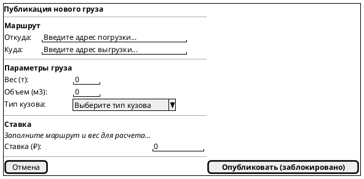
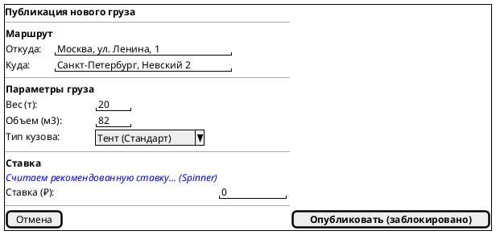
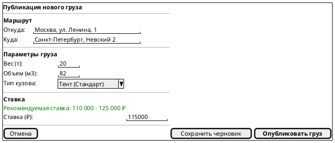

# Поведенческий контракт: Экран публикации груза

## Визуальное состояние экрана в разные моменты времени (PlantUML Salt)

Вместо абстрактной схемы переходов, ниже представлены wireframe-модели интерфейса на разных этапах заполнения с помощью языка **PlantUML Salt**.

### 1. Начальное состояние (Initial Form)
Пользователь только открыл форму. Ничего не заполнено, расчет цены недоступен.

### 2. Заполнение маршрута и расчет цены (Calculating)
Пользователь ввел маршрут и параметры. Система делает фоновый запрос к `GET /api/v1/pricing/estimate`.

### 3. Рекомендация получена, готовность к публикации (Ready to Publish)
Цена рассчитана сервером. Пользователь ввел свою ставку, кнопка публикации разблокирована.

## Детальные поведенческие контракты

- **Геокодинг (Дебаунс 300мс)**: При вводе в поле адреса идет запрос к API (`/maps/geocode`). Выбор из выпадающего списка центрирует миникарту на точке.
- **Оптимистичный расчет цены (State 2 -> 3)**: Как только заполнены маршрут и вес, форма блокирует виджет цены лоадером, делает фоновый запрос `GET /estimate` и плавно показывает рекомендуемую ставку (State 3).
- **Разблокировка кнопки**: Кнопка "Опубликовать груз" становится активной только после заполнения обязательных полей (Маршрут, Вес, Кузов) и ввода валидной ставки.
- **Идемпотентность кнопки**: При клике "Опубликовать" генерируется `Idempotency-Key`. Кнопка переходит в состояние `Loading (disabled)`. При успешном `POST /api/v1/loads (201 Created)` происходит мгновенный редирект в карточку созданного груза.
