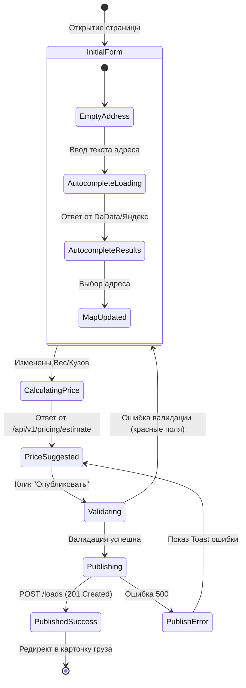

# Поведенческий контракт: Экран публикации груза

## Визуальное состояние экрана
Многошаговая или длинная форма (Wizard):
1. **Маршрут**: Поля "Откуда" и "Куда", интерактивная миникарта.
2. **Параметры груза**: Вес, объем, тип кузова, температурный режим.
3. **Даты и ставки**: Окна погрузки/выгрузки, виджет "Рекомендуемая ставка", поле ввода ставки.
4. **Панель действий**: Кнопка "Опубликовать", "Сохранить как черновик".

## Диаграмма состояний интерфейса

## Детальные поведенческие контракты
- **Геокодинг (Дебаунс 300мс)**: При вводе в поле адреса идет запрос к API. Выбор из выпадающего списка центрирует миникарту на точке.
- **Оптимистичный расчет цены**: Как только заполнены маршрут и вес, форма блокирует виджет цены лоадером, делает фоновый запрос `GET /estimate` и плавно показывает рекомендуемую ставку (например, `110 000 – 125 000 ₽`).
- **Идемпотентность кнопки**: При клике "Опубликовать" генерируется `Idempotency-Key`. Кнопка переходит в состояние `Loading (disabled)`. При успехе - мгновенный редирект.
