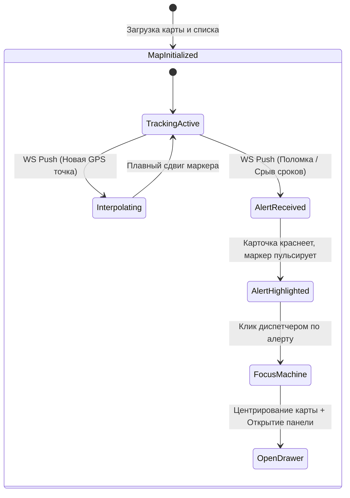

# Поведенческий контракт: Диспетчерский пульт (Active Fleet Board)

## Визуальное состояние экрана
Профессиональный Split-view интерфейс (разделение экрана 30/70):
1. **Левая панель (Список рейсов)**:
   - Сводка активных машин с цветовым кодированием статусов здоровья (Зеленый — в графике, Желтый — риск опоздания > 1ч, Красный — критический алерт / ДТП).
2. **Правая панель (Интерактивная карта)**:
   - Отображение всех машин автопарка в реальном времени.

## Диаграмма состояний интерфейса

## Детальные поведенческие контракты
- **WebSocket Телеметрия**: На клиент приходит событие `gps_position_updated` с частотой раз в 10-30 секунд. Маркер грузовика на карте не "прыгает", а плавно переезжает на новые координаты с помощью CSS/JS анимации (интерполяция).
- **Фокусировка на проблеме**: Если система детектирует аномалию (например, остановка на трассе > 2 часов), генерируется алерт. В левом списке этот рейс поднимается наверх с красным значком.
- **Клик по алерту**:
  1. Карта плавно масштабируется (fly-to) к проблемной машине.
  2. Справа (поверх карты) выезжает боковой Drawer (шторка) с кнопками быстрого реагирования: "Связаться с водителем (SIP звонок)", "Назначить резервный тягач", "Оформить акт простоя".
