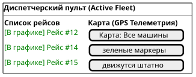
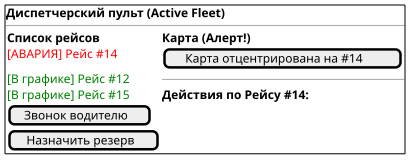

# Поведенческий контракт: Диспетчерский пульт (Active Fleet Board)

## Визуальное состояние экрана в разные моменты времени (PlantUML Salt)

### 1. Штатный режим (В графике)
Рейсы выполняются без сбоев. Зеленые карточки слева, карта справа.

### 2. Экстренная ситуация (Алерт)
По WebSocket пришло сообщение об отклонении или поломке. Рейс становится красным, поднимается в топ. При клике на него карта центрируется на проблеме и открывается панель быстрых действий (Drawer).

## Детальные поведенческие контракты
- **WebSocket Телеметрия**: На клиент приходит событие `gps_position_updated` с частотой раз в 10-30 секунд. Маркер грузовика на карте плавно переезжает на новые координаты с помощью CSS/JS интерполяции.
- **Фокусировка на проблеме**: Если система детектирует аномалию (остановка на трассе > 2 часов), генерируется алерт. В левом списке этот рейс поднимается наверх с красным значком.
- **Действия**: Клик по алерту открывает боковой Drawer (шторка) с кнопками быстрого реагирования: "Звонок", "Резерв", "Акт простоя".
