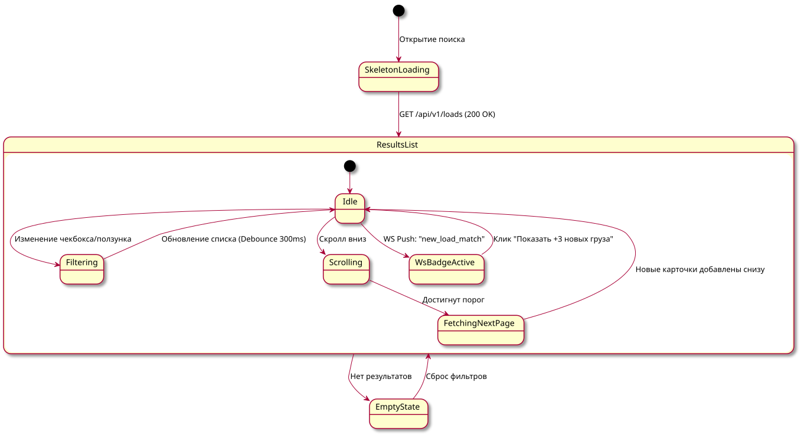

# Поведенческий контракт: Экран поиска и фильтрации грузов

## Визуальное состояние экрана
Сплит-интерфейс:
1. **Левая панель (Фильтры)**: Дата, радиус, тип кузова, тоннаж, быстрые теги ("Без торга", "Быстрая оплата").
2. **Центральная панель (Список)**: Карточки грузов с бесконечным скроллом.
3. **Правая панель (или переключатель)**: Карта с кластеризацией грузов.

## Диаграмма состояний интерфейса

## Детальные поведенческие контракты
- **Фильтрация**: Изменение любого фильтра вызывает обновление списка без перезагрузки страницы (Debounce 300-500ms). Старый список становится полупрозрачным (opacity 0.6) + spinner.
- **Бесконечный скролл (Infinite Scroll)**: При достижении 80% высоты списка отправляется запрос за следующей страницей (по `cursor`). Позиция скролла сохраняется.
- **Real-time бейдж**: Если пользователь смотрит список, а на сервере появился новый подходящий груз, по WebSocket приходит уведомление. Сверху над списком появляется "плавающая" кнопка `Показать +3 новых груза`. Скролл пользователя **не сбивается**.
