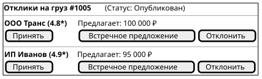

# Поведенческий контракт: Экран торга и работы с откликами

## Визуальное состояние экрана в разные моменты времени (PlantUML Salt)

### 1. Ожидание решения (Офферы получены)
Грузовладелец видит несколько откликов от разных перевозчиков.

### 2. Оффер принят (Сделка заключена)
После нажатия "Принять" на карточке победителя, груз меняет статус. Победитель подсвечивается зеленым, а остальные карточки блокируются (Disabled).

## Детальные поведенческие контракты
- **Встречное предложение**: Клик открывает Inline-инпут или модальное окно. После отправки ставка меняется, статус переходит в `Ожидает ответа перевозчика`.
- **Акцепт оффера**: Вызов диалога подтверждения. При подтверждении:
  1. Оптимистичное обновление: карточка оффера становится зеленой ("Победитель").
  2. Все остальные карточки в списке становятся серыми (Disabled).
  3. Переход в мастер генерации договора-заявки (`TransportOrder`).
