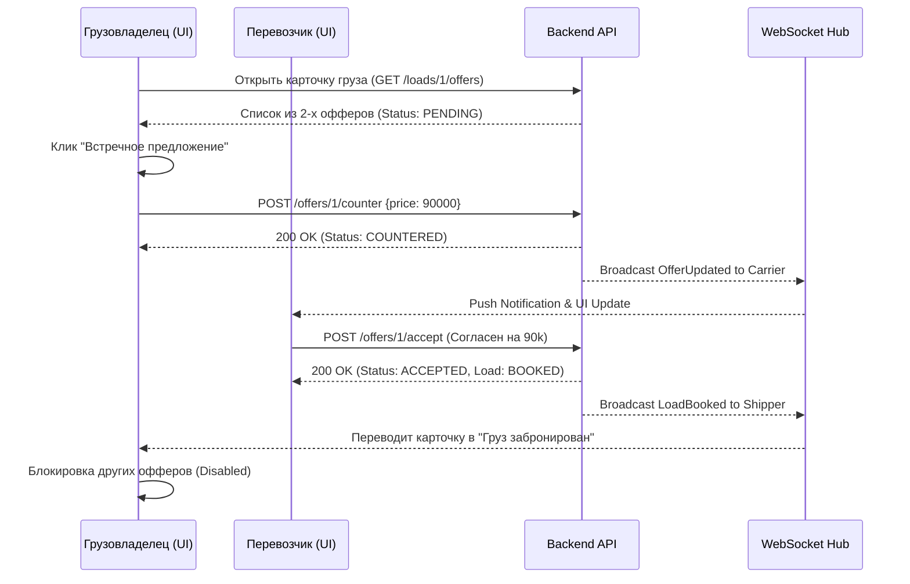

# Поведенческий контракт: Экран торга и работы с откликами

## Визуальное состояние экрана
Экран управления откликами (внутри карточки груза грузовладельца):
1. **Шапка груза**: Текущий статус груза (Опубликован, Забронирован).
2. **Список офферов**: Карточки перевозчиков. На карточке: Рейтинг (звезды), Название, Предлагаемая ставка, Окно погрузки, Кнопки ("Принять", "Встречное предложение", "Отклонить").

## Диаграмма состояний интерфейса

## Детальные поведенческие контракты
- **Встречное предложение**: Клик открывает Inline-инпут или модальное окно. После отправки ставка в карточке меняется, статус переходит в `Ожидает ответа перевозчика` (желтый бейдж).
- **Акцепт оффера**: Вызов диалога подтверждения ("Вы точно хотите назначить ООО Транс на этот груз за 90 000 ₽?"). При подтверждении:
  1. Оптимистичное обновление: карточка оффера становится зеленой ("Победитель").
  2. Все остальные карточки в списке становятся серыми (Disabled) с плашкой "Груз отдан другому".
  3. Переход в мастер генерации договора-заявки (`TransportOrder`).
