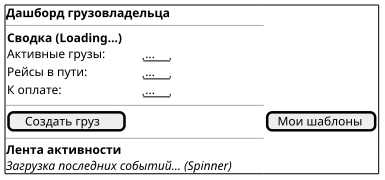

# Поведенческий контракт: Главный дашборд грузовладельца (Shipper Dashboard)

## Визуальное состояние экрана в разные моменты времени (PlantUML Salt)

Вместо абстрактной схемы, ниже представлены wireframe-модели интерфейса.

### 1. Состояние загрузки (Loading Data)
При входе на дашборд отправляется запрос `GET /api/v1/dashboard/shipper/kpi`. Виджеты показывают Skeleton Loader.

### 2. Дашборд загружен (Dashboard Active)
Данные подгружены. В ленте активности (Activity Feed) отображаются последние события, получаемые в реальном времени.

## Детальные поведенческие контракты

- **Инициализация**: При монтировании компонента отправляется запрос `GET /api/v1/dashboard/shipper/kpi`. Показывается Skeleton loader.
- **Обновление**: Лента активности получает обновления по WebSockets (`ws://.../notifications`). При получении нового события (например, `OfferReceived`) лента смещается вниз, новое событие появляется сверху с легким подсвечиванием фона (fade-out highlight).
