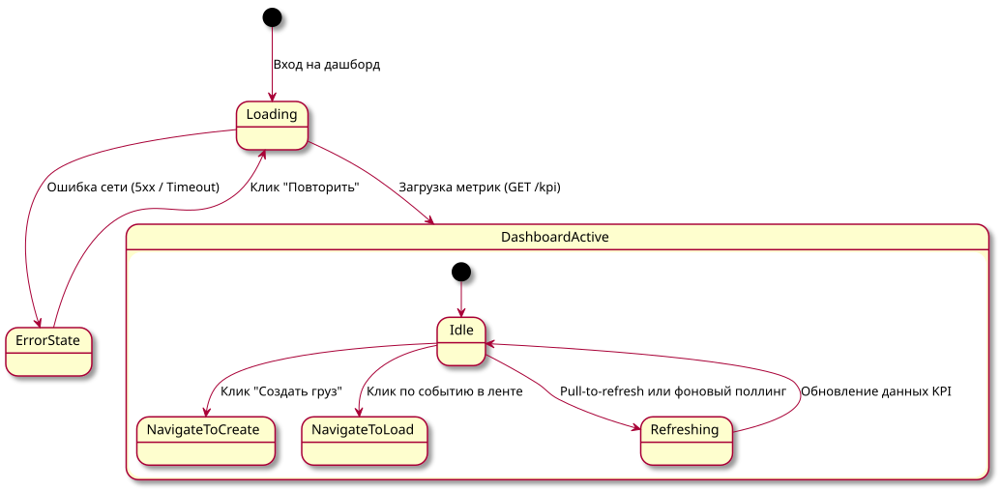

# Поведенческий контракт: Главный дашборд грузовладельца (Shipper Dashboard)

## Визуальное состояние экрана
Экран состоит из следующих блоков:
1. **Сводные KPI-виджеты (Верхняя панель)**:
   - "Активные грузы" (в поиске).
   - "Рейсы в пути" (с индикатором задержек).
   - "Ожидают оплаты" (сумма и количество счетов).
2. **Панель быстрых действий**: Крупная кнопка "Создать груз", "Мои шаблоны".
3. **Лента активности (Activity Feed)**: Последние события (отклики на грузы, изменение статусов рейсов, новые документы).

## Диаграмма состояний интерфейса

## Детальные поведенческие контракты

- **Инициализация**: При монтировании компонента отправляется запрос `GET /api/v1/dashboard/shipper/kpi`. Показывается Skeleton loader.
- **Обновление**: Лента активности получает обновления по WebSockets (`ws://.../notifications`). При получении нового события (например, `OfferReceived`) лента смещается вниз, новое событие появляется сверху с легким подсвечиванием фона (fade-out highlight).
