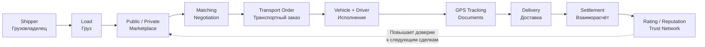

# Техническая документация логистической платформы

## О продукте

Цифровой маркетплейс грузоперевозок, объединяющий грузовладельцев, экспедиторов, перевозчиков и их инфраструктуру в единую экосистему.

Платформа — это не просто «сайт с грузами и машинами». Это комплексное решение на пересечении пяти ключевых доменов:

| Домен                     | Описание                                                                          |
| ------------------------- | --------------------------------------------------------------------------------- |
| **Logistics Marketplace** | Биржа грузов и транспорта с публичными и приватными площадками                    |
| **Transport Management**  | Полный цикл управления транспортными заказами от назначения до завершения         |
| **Real-Time Visibility**  | GPS-трекинг, ETA, геозоны, прогресс по маршруту в реальном времени                |
| **Trust Network**         | Верификация, рейтинги, репутация, оценка рисков и платёжная история               |
| **Integration Platform**  | Открытое API и интеграции с TMS, ERP, WMS, GPS-провайдерами, платёжными системами |

Основные участники: грузовладельцы (shippers), экспедиторы (freight forwarders), перевозчики (carriers), транспортные компании, управляющие автопарками, диспетчеры, водители, администраторы платформы, а также внешние системы (TMS/ERP/WMS).

---

## Основной бизнес-поток



**Обратный сценарий:** перевозчик публикует свободное транспортное средство (Truck Offer) → грузовладелец находит и бронирует его через маркетплейс.

---

## Навигационное дерево docs/

```
docs/
├── README.md ← вы здесь
├── glossary/
│   └── glossary.md
```

---

### 01 — Продукт и предметная область

| Документ                                                                   | Описание                                     |
| -------------------------------------------------------------------------- | -------------------------------------------- |
| [product-overview.md](01-product-and-domain/product-overview.md)           | Обзор продукта, цели, ценностное предложение |
| [actors-and-roles.md](01-product-and-domain/actors-and-roles.md)           | Участники платформы и их роли                |
| [business-capabilities.md](01-product-and-domain/business-capabilities.md) | Карта бизнес-возможностей                    |
| [business-model.md](01-product-and-domain/business-model.md)               | Бизнес-модель и монетизация                  |
| [domain-map.md](01-product-and-domain/domain-map.md)                       | Карта доменов                                |
| [bounded-contexts.md](01-product-and-domain/bounded-contexts.md)           | Ограниченные контексты (DDD)                 |

---

### 02 — Требования

| Документ                                                                         | Описание                              |
| -------------------------------------------------------------------------------- | ------------------------------------- |
| [functional-requirements.md](02-requirements/functional-requirements.md)         | Функциональные требования             |
| [non-functional-requirements.md](02-requirements/non-functional-requirements.md) | Нефункциональные требования           |
| [scalability.md](02-requirements/scalability.md)                                 | Масштабируемость                      |
| [availability.md](02-requirements/availability.md)                               | Доступность                           |
| [security.md](02-requirements/security.md)                                       | Безопасность                          |
| [observability.md](02-requirements/observability.md)                             | Наблюдаемость                         |
| [compliance.md](02-requirements/compliance.md)                                   | Соответствие регуляторным требованиям |
| [disaster-recovery.md](02-requirements/disaster-recovery.md)                     | Аварийное восстановление              |

---

### 03 — Архитектура

| Документ                                                                   | Описание                           |
| -------------------------------------------------------------------------- | ---------------------------------- |
| [architecture-overview.md](03-architecture/architecture-overview.md)       | Обзор архитектуры                  |
| [principles.md](03-architecture/principles.md)                             | Архитектурные принципы             |
| [system-context.md](03-architecture/system-context.md)                     | Системный контекст                 |
| [deployment-model.md](03-architecture/deployment-model.md)                 | Модель развёртывания               |
| [data-architecture.md](03-architecture/data-architecture.md)               | Архитектура данных                 |
| [integration-architecture.md](03-architecture/integration-architecture.md) | Архитектура интеграций             |
| [security-architecture.md](03-architecture/security-architecture.md)       | Архитектура безопасности           |
| [c4/](03-architecture/c4/)                                                 | Диаграммы C4                       |
| [adr/](03-architecture/adr/)                                               | Записи архитектурных решений (ADR) |
| [views/](03-architecture/views/)                                           | Архитектурные представления        |

---

### 04 — Доменная модель

| Документ                                           | Описание                           |
| -------------------------------------------------- | ---------------------------------- |
| [domain-model.md](04-domain/domain-model.md)       | Доменная модель                    |
| [aggregates.md](04-domain/aggregates.md)           | Агрегаты                           |
| [entities.md](04-domain/entities.md)               | Сущности                           |
| [value-objects.md](04-domain/value-objects.md)     | Объекты-значения                   |
| [domain-events.md](04-domain/domain-events.md)     | Доменные события                   |
| [invariants.md](04-domain/invariants.md)           | Инварианты                         |
| [policies.md](04-domain/policies.md)               | Политики                           |
| [state-machines/](04-domain/state-machines/)       | Конечные автоматы (state machines) |
| [sequence-diagrams/](04-domain/sequence-diagrams/) | Диаграммы последовательностей      |
| [erd/](04-domain/erd/)                             | ER-диаграммы                       |

---

### 05 — Бизнес-процессы

| Документ                                                   | Описание                            |
| ---------------------------------------------------------- | ----------------------------------- |
| [use-cases/](05-business-processes/use-cases/)             | Сценарии использования              |
| [workflows/](05-business-processes/workflows/)             | Рабочие процессы (BPMN)             |
| [exception-flows/](05-business-processes/exception-flows/) | Исключительные и ошибочные сценарии |

---

### 06 — Маркетплейс

| Документ                                                          | Описание              |
| ----------------------------------------------------------------- | --------------------- |
| [load-marketplace.md](06-marketplace/load-marketplace.md)         | Биржа грузов          |
| [truck-marketplace.md](06-marketplace/truck-marketplace.md)       | Биржа транспорта      |
| [matching.md](06-marketplace/matching.md)                         | Автоматический подбор |
| [search.md](06-marketplace/search.md)                             | Поиск                 |
| [ranking.md](06-marketplace/ranking.md)                           | Ранжирование          |
| [recommendations.md](06-marketplace/recommendations.md)           | Рекомендации          |
| [counter-offers.md](06-marketplace/counter-offers.md)             | Встречные предложения |
| [negotiation.md](06-marketplace/negotiation.md)                   | Переговоры            |
| [private-marketplaces.md](06-marketplace/private-marketplaces.md) | Приватные площадки    |
| [tendering.md](06-marketplace/tendering.md)                       | Тендеры               |

---

### 07 — Исполнение перевозки

| Документ                                                            | Описание                     |
| ------------------------------------------------------------------- | ---------------------------- |
| [transport-order.md](07-transport-execution/transport-order.md)     | Транспортный заказ           |
| [assignment.md](07-transport-execution/assignment.md)               | Назначение ТС и водителя     |
| [pickup.md](07-transport-execution/pickup.md)                       | Погрузка                     |
| [transit.md](07-transport-execution/transit.md)                     | Транзит                      |
| [delivery.md](07-transport-execution/delivery.md)                   | Доставка                     |
| [exceptions.md](07-transport-execution/exceptions.md)               | Исключения и инциденты       |
| [statuses.md](07-transport-execution/statuses.md)                   | Статусная модель             |
| [tracking.md](07-transport-execution/tracking.md)                   | Трекинг в реальном времени   |
| [proof-of-delivery.md](07-transport-execution/proof-of-delivery.md) | Подтверждение доставки (PoD) |

---

### 08 — Компании и доверие

| Документ                                                        | Описание           |
| --------------------------------------------------------------- | ------------------ |
| [company-profile.md](08-companies-and-trust/company-profile.md) | Профиль компании   |
| [verification.md](08-companies-and-trust/verification.md)       | Верификация        |
| [ratings.md](08-companies-and-trust/ratings.md)                 | Рейтинги           |
| [reputation.md](08-companies-and-trust/reputation.md)           | Репутация          |
| [risk-scoring.md](08-companies-and-trust/risk-scoring.md)       | Оценка рисков      |
| [payment-history.md](08-companies-and-trust/payment-history.md) | Платёжная история  |
| [permissions.md](08-companies-and-trust/permissions.md)         | Права и разрешения |

---

### 09 — Автопарк

| Документ                                                              | Описание                   |
| --------------------------------------------------------------------- | -------------------------- |
| [vehicles.md](09-fleet/vehicles.md)                                   | Транспортные средства      |
| [trailers.md](09-fleet/trailers.md)                                   | Прицепы                    |
| [drivers.md](09-fleet/drivers.md)                                     | Водители                   |
| [fleets.md](09-fleet/fleets.md)                                       | Автопарки                  |
| [availability.md](09-fleet/availability.md)                           | Доступность                |
| [vehicle-driver-assignment.md](09-fleet/vehicle-driver-assignment.md) | Назначение водителей на ТС |

---

### 10 — Геолокация и маршрутизация

| Документ                                                                   | Описание          |
| -------------------------------------------------------------------------- | ----------------- |
| [addresses.md](10-location-and-routing/addresses.md)                       | Адреса            |
| [geocoding.md](10-location-and-routing/geocoding.md)                       | Геокодирование    |
| [routing.md](10-location-and-routing/routing.md)                           | Маршрутизация     |
| [distance-calculation.md](10-location-and-routing/distance-calculation.md) | Расчёт расстояний |
| [geo-indexing.md](10-location-and-routing/geo-indexing.md)                 | Геоиндексирование |
| [gps-ingestion.md](10-location-and-routing/gps-ingestion.md)               | Приём GPS-данных  |
| [tracking.md](10-location-and-routing/tracking.md)                         | Трекинг           |

---

### 11 — Документы

| Документ                                                      | Описание                 |
| ------------------------------------------------------------- | ------------------------ |
| [document-management.md](11-documents/document-management.md) | Управление документами   |
| [e-documents.md](11-documents/e-documents.md)                 | Электронные документы    |
| [document-types.md](11-documents/document-types.md)           | Типы документов          |
| [signatures.md](11-documents/signatures.md)                   | Электронные подписи      |
| [document-lifecycle.md](11-documents/document-lifecycle.md)   | Жизненный цикл документа |
| [retention.md](11-documents/retention.md)                     | Хранение и ретенция      |

---

### 12 — Финансы

| Документ                                              | Описание           |
| ----------------------------------------------------- | ------------------ |
| [pricing.md](12-finance/pricing.md)                   | Ценообразование    |
| [freight-rates.md](12-finance/freight-rates.md)       | Фрахтовые ставки   |
| [commissions.md](12-finance/commissions.md)           | Комиссии           |
| [invoices.md](12-finance/invoices.md)                 | Счета              |
| [payments.md](12-finance/payments.md)                 | Платежи            |
| [guarantees.md](12-finance/guarantees.md)             | Гарантии           |
| [factoring.md](12-finance/factoring.md)               | Факторинг          |
| [financial-events.md](12-finance/financial-events.md) | Финансовые события |

---

### 13 — Коммуникация

| Документ                                              | Описание              |
| ----------------------------------------------------- | --------------------- |
| [messenger.md](13-communication/messenger.md)         | Мессенджер платформы  |
| [notifications.md](13-communication/notifications.md) | Уведомления           |
| [email.md](13-communication/email.md)                 | Email                 |
| [sms.md](13-communication/sms.md)                     | SMS                   |
| [push.md](13-communication/push.md)                   | Push-уведомления      |
| [realtime.md](13-communication/realtime.md)           | Реалтайм-коммуникация |

---

### 14 — API

| Документ                                      | Описание              |
| --------------------------------------------- | --------------------- |
| [api-guidelines.md](14-api/api-guidelines.md) | Стандарты API         |
| [authentication.md](14-api/authentication.md) | Аутентификация        |
| [authorization.md](14-api/authorization.md)   | Авторизация           |
| [versioning.md](14-api/versioning.md)         | Версионирование       |
| [idempotency.md](14-api/idempotency.md)       | Идемпотентность       |
| [pagination.md](14-api/pagination.md)         | Пагинация             |
| [errors.md](14-api/errors.md)                 | Обработка ошибок      |
| [rate-limits.md](14-api/rate-limits.md)       | Rate limiting         |
| [openapi/](14-api/openapi/)                   | Спецификации OpenAPI  |
| [asyncapi/](14-api/asyncapi/)                 | Спецификации AsyncAPI |
| [proto/](14-api/proto/)                       | Protobuf-контракты    |

---

### 15 — Данные

| Документ                                   | Описание         |
| ------------------------------------------ | ---------------- |
| [data-model.md](15-data/data-model.md)     | Модель данных    |
| [ownership.md](15-data/ownership.md)       | Владение данными |
| [consistency.md](15-data/consistency.md)   | Консистентность  |
| [replication.md](15-data/replication.md)   | Репликация       |
| [retention.md](15-data/retention.md)       | Ретенция         |
| [archival.md](15-data/archival.md)         | Архивация        |
| [migrations.md](15-data/migrations.md)     | Миграции         |
| [search-index.md](15-data/search-index.md) | Поисковый индекс |
| [erd/](15-data/erd/)                       | ER-диаграммы     |

---

### 16 — Интеграции

| Документ                                                         | Описание                          |
| ---------------------------------------------------------------- | --------------------------------- |
| [tms/](16-integrations/tms/)                                     | Интеграция с TMS                  |
| [erp/](16-integrations/erp/)                                     | Интеграция с ERP                  |
| [wms/](16-integrations/wms/)                                     | Интеграция с WMS                  |
| [gps/](16-integrations/gps/)                                     | GPS-провайдеры                    |
| [maps/](16-integrations/maps/)                                   | Картографические сервисы          |
| [payment-providers/](16-integrations/payment-providers/)         | Платёжные провайдеры              |
| [e-document-providers/](16-integrations/e-document-providers/)   | Провайдеры электронных документов |
| [identity-verification/](16-integrations/identity-verification/) | Верификация личности              |
| [external-marketplaces/](16-integrations/external-marketplaces/) | Внешние маркетплейсы              |

---

### 17 — Безопасность

| Документ                                               | Описание                       |
| ------------------------------------------------------ | ------------------------------ |
| [threat-model.md](17-security/threat-model.md)         | Модель угроз                   |
| [authentication.md](17-security/authentication.md)     | Аутентификация                 |
| [authorization.md](17-security/authorization.md)       | Авторизация                    |
| [tenant-isolation.md](17-security/tenant-isolation.md) | Изоляция тенантов              |
| [secrets.md](17-security/secrets.md)                   | Управление секретами           |
| [encryption.md](17-security/encryption.md)             | Шифрование                     |
| [audit-log.md](17-security/audit-log.md)               | Аудит-лог                      |
| [abuse-prevention.md](17-security/abuse-prevention.md) | Предотвращение злоупотреблений |
| [security-events.md](17-security/security-events.md)   | События безопасности           |

---

### 18 — Наблюдаемость

| Документ                                        | Описание        |
| ----------------------------------------------- | --------------- |
| [logging.md](18-observability/logging.md)       | Логирование     |
| [metrics.md](18-observability/metrics.md)       | Метрики         |
| [tracing.md](18-observability/tracing.md)       | Трассировка     |
| [alerts.md](18-observability/alerts.md)         | Алерты          |
| [dashboards.md](18-observability/dashboards.md) | Дашборды        |
| [slo.md](18-observability/slo.md)               | SLO / SLI / SLA |

---

### 19 — Эксплуатация

| Документ                                                       | Описание                          |
| -------------------------------------------------------------- | --------------------------------- |
| [deployment.md](19-operations/deployment.md)                   | Развёртывание                     |
| [environments.md](19-operations/environments.md)               | Среды окружения                   |
| [ci-cd.md](19-operations/ci-cd.md)                             | CI/CD                             |
| [backups.md](19-operations/backups.md)                         | Резервное копирование             |
| [disaster-recovery.md](19-operations/disaster-recovery.md)     | Аварийное восстановление          |
| [runbooks/](19-operations/runbooks/)                           | Оперативные инструкции (runbooks) |
| [incident-management.md](19-operations/incident-management.md) | Управление инцидентами            |

---

### 20 — Пользовательский интерфейс

| Документ                                     | Описание                   |
| -------------------------------------------- | -------------------------- |
| [screen-contracts/](20-ui/screen-contracts/)             | Пользовательские сценарии  |
| [screen-contracts/](20-ui/screen-contracts/) | Контракты экранов          |
| [permissions/](20-ui/permissions/)           | Права доступа к интерфейсу |
| [realtime-ui.md](20-ui/realtime-ui.md)       | Реалтайм-интерфейс         |

---

### 21 — Тестирование

| Документ                                                | Описание               |
| ------------------------------------------------------- | ---------------------- |
| [test-strategy.md](21-testing/test-strategy.md)         | Стратегия тестирования |
| [unit-tests.md](21-testing/unit-tests.md)               | Юнит-тесты             |
| [integration-tests.md](21-testing/integration-tests.md) | Интеграционные тесты   |
| [contract-tests.md](21-testing/contract-tests.md)       | Контрактные тесты      |
| [e2e-tests.md](21-testing/e2e-tests.md)                 | E2E-тесты              |
| [load-tests.md](21-testing/load-tests.md)               | Нагрузочные тесты      |
| [chaos-tests.md](21-testing/chaos-tests.md)             | Хаос-тесты             |
| [test-data.md](21-testing/test-data.md)                 | Тестовые данные        |

---

## Для кого эта документация

| Роль                     | Основные разделы                                                  |
| ------------------------ | ----------------------------------------------------------------- |
| **Архитектор**           | 01 — Продукт и домен, 03 — Архитектура, 04 — Доменная модель, ADR |
| **Бэкенд-разработчик**   | 04 — Доменная модель, 05 — Бизнес-процессы, 14 — API, 15 — Данные |
| **Фронтенд-разработчик** | 14 — API, 20 — UI, 13 — Коммуникация                              |
| **Бизнес-аналитик**      | 01 — Продукт, 05 — Бизнес-процессы, 06 — Маркетплейс, Глоссарий   |
| **DevOps / SRE**         | 18 — Наблюдаемость, 19 — Эксплуатация, 03 — Архитектура           |
| **QA-инженер**           | 21 — Тестирование, 05 — Бизнес-процессы, 14 — API                 |

---

## Принципы документации

1. **Язык** — русский. Английские термины приводятся в скобках при первом упоминании и в [глоссарии](glossary/glossary.md).
2. **Diagrams-as-code** — все диаграммы описаны как код (Mermaid, PlantUML, BPMN 2.0) и хранятся рядом с текстом.
3. **Автоматическая генерация SVG** — GitHub Actions конвертирует `.mmd`, `.puml`, `.bpmn` в SVG (см. [`.github/workflows/generate-diagrams.yml`](../.github/workflows/generate-diagrams.yml)).
4. **Итеративная разработка** — документация развивается вместе с продуктом; каждый PR с изменением архитектуры содержит обновление соответствующих разделов.
5. **Обоснованность решений** — каждое значимое архитектурное решение фиксируется как ADR в [03-architecture/adr/](03-architecture/adr/).
6. **Связность** — документы связаны между собой относительными ссылками; ключевые термины ведут в глоссарий.

---

## Быстрые ссылки

| Точка входа      | Ссылка                                                               |
| ---------------- | -------------------------------------------------------------------- |
| Обзор продукта   | [product-overview.md](01-product-and-domain/product-overview.md)     |
| Bounded Contexts | [bounded-contexts.md](01-product-and-domain/bounded-contexts.md)     |
| Архитектура      | [architecture-overview.md](03-architecture/architecture-overview.md) |
| Domain Model     | [domain-model.md](04-domain/domain-model.md)                         |
| API              | [api-guidelines.md](14-api/api-guidelines.md)                        |
| ADR              | [adr/](03-architecture/adr/)                                         |
| Глоссарий        | [glossary.md](glossary/glossary.md)                                  |
